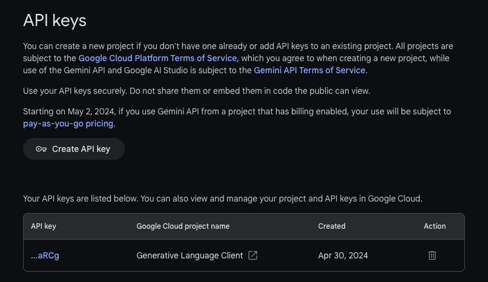

# Gemini API

## 必需申請Gemini API key

### Google Gemini
- Google Gemini的免費版本，每分鐘限制呼叫60次. 
- Google Gemini文本生成的history歷史查閱，目前中文會出現亂碼
- Google Gemini可以解析圖片

### 1.登入:https://ai.google.dev


### 建立 API Key



### 安裝套件

```
> pip install -q -U google-genai
> pip install python-dotenv
```

### 載入api

```python
import google.generativeai as genai 
```

### 簡單範例
#### .env file

```
Gemini_API_KEY='您的API_KEY'
```

```python
from google import genai

# The client gets the API key from the environment variable `GEMINI_API_KEY`.
client = genai.Client()

response = client.models.generate_content(
    model="gemini-2.5-flash", contents="Explain how AI works in a few words"
)
print(response.text)
```
