# Line Notify服務
## 專案1:整合LINE Notify讓訊息發送至Line群組

### 申請步驟
#### 1. 登入至[https://notify-bot.line.me/my/](https://notify-bot.line.me/my/). 

#### 2. 登入您自已的line帳號  


#### 3. 點選發行存取權杖  
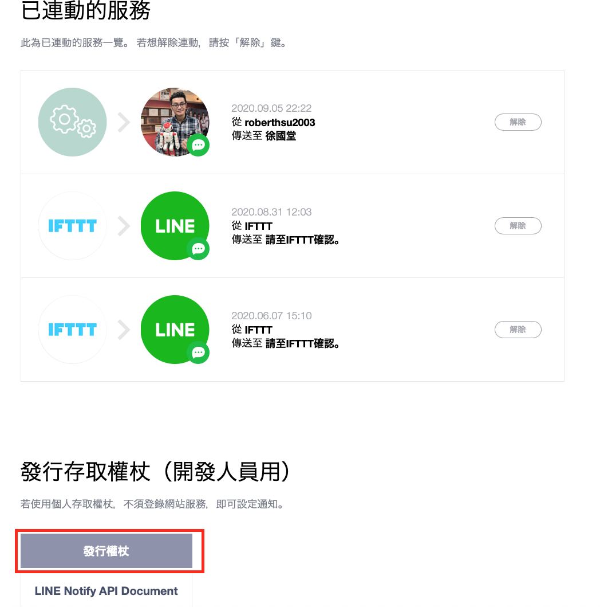

#### 4. 建立發行服務
	- 按下發行後,您的line將會收到提醒通知
	- 記得在line內將line Notify加入到您想要加入的line群組內
	
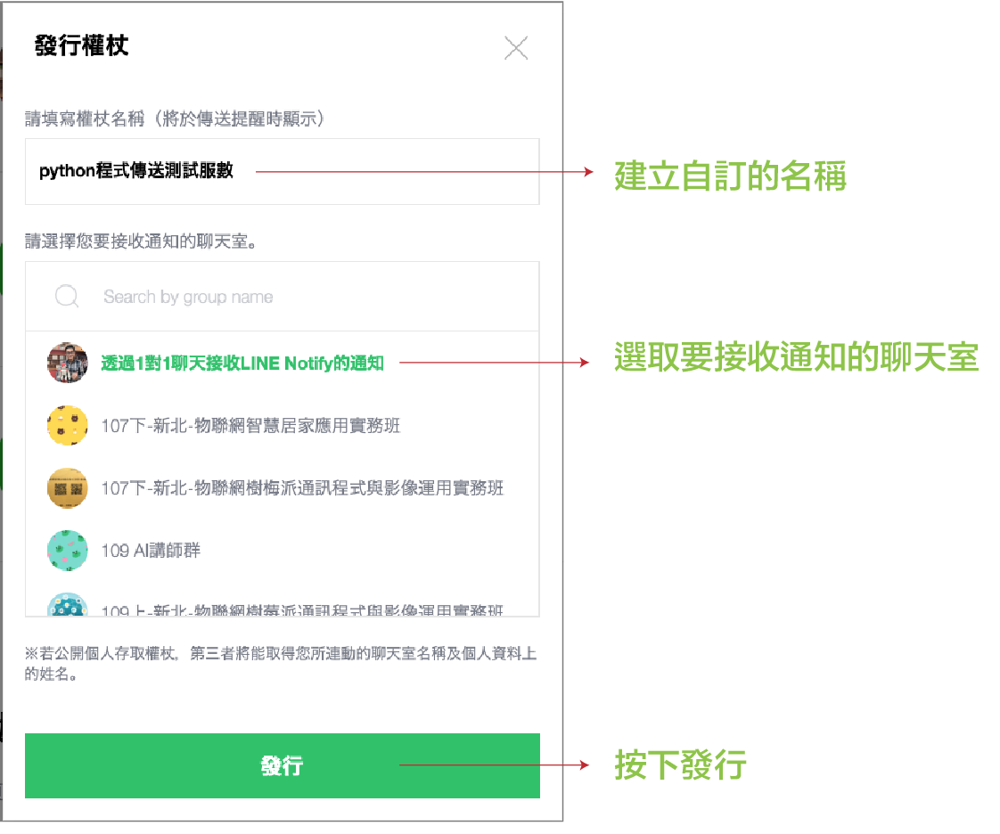  

#### 5.保留發行權杖(沒有保留,未來將無法找到這個金鑰)  
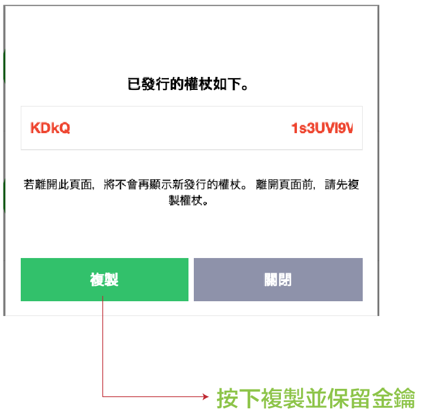

#### 6.line會建立一個新的連動服數
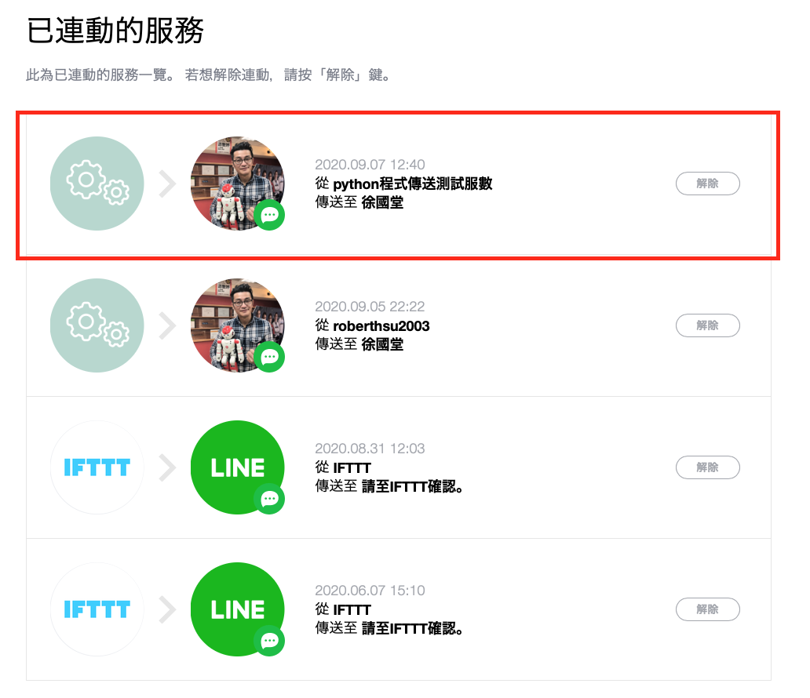

### 在自已電腦環境上安裝line的開發者套件
	pip install lineTool
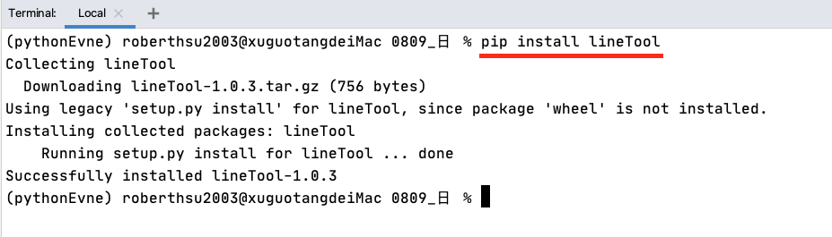

### 在自已電腦環境上安裝requests套件
	pip install requests
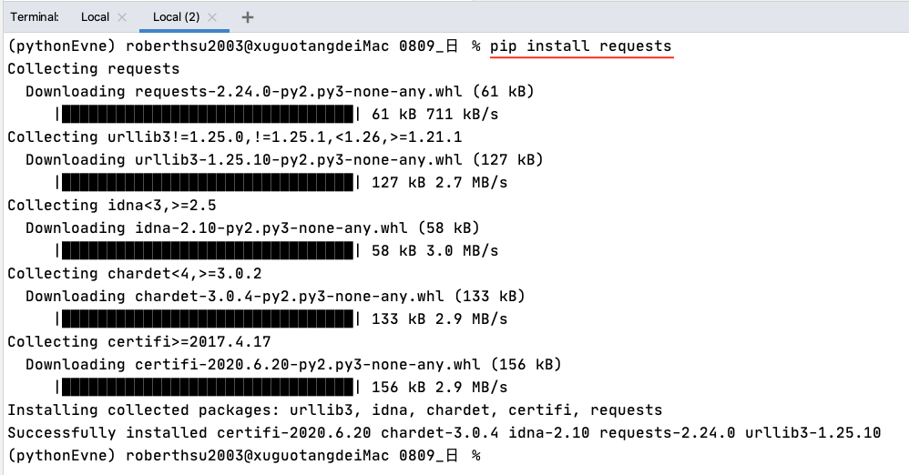

### 測試是否安裝成功  
```python
>>> import lineTool
>>> token = "請使用您剛剛取得的金鑰"
>>> msg = "Python 語言整合通訊軟體,恭喜您"
>>> response=lineTool.lineNotify(token,msg)
>>> if response == 200:
	    print("傳送成功")
	else:
	    print("傳送失敗")
```

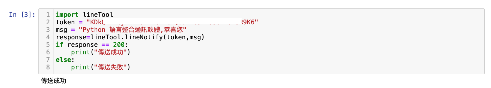 
 
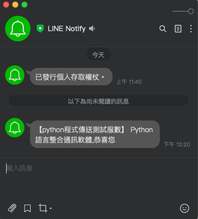

## 專案2:整合LINE Notify和matplotlib發送圖片至Line群組

### 1.建立一個math.txt文字檔
```
Lewis,89
Ada,99
Julia,54
Nancy,65
Judy,78
```
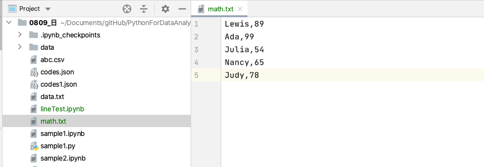

### 2.在自已的電腦安裝matplotlib
	pip install matplotlib
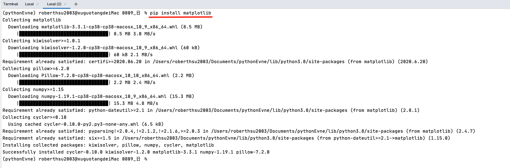

### 3.在jupyter notebook上建立程式
```python
#請您輸入班上數學成績單，畫出圖片和建立圖片
with open('math.txt') as file:
    content = file.read()
    
contentList = content.split('\n')    
names, scores = [], []
for item in contentList:
    itemList = item.split(',')
    names.append(itemList[0])
    scores.append(int(itemList[1]))

import matplotlib.pyplot as plt
plt.plot(names, scores)
plt.savefig('math.jpg')
```
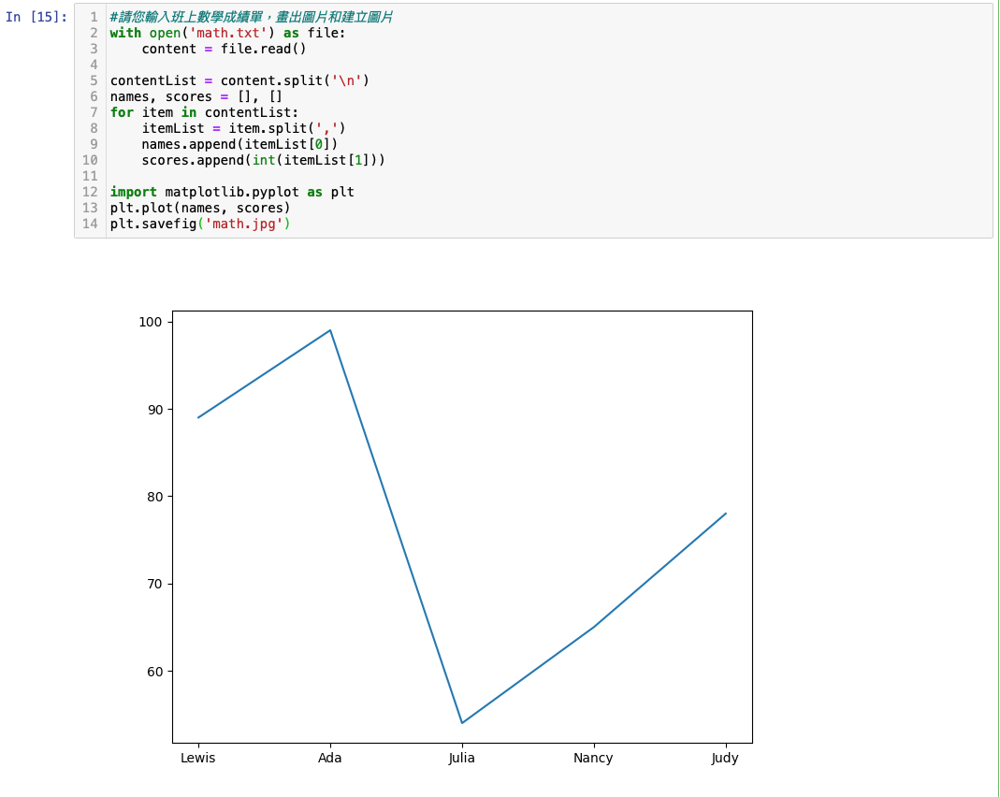

### 4.建立自訂的function可以同時傳送message和圖片給line Notify
```python
#發送message和圖片給line
import requests
def sendLineNotify(token, msg, picURI):
    url = "https://notify-api.line.me/api/notify"
    headers = {"Authorization":"Bearer " + token}
    payload = {"message": msg}
    files = {"imageFile":open(picURI, 'rb')}
    r = requests.post(url, headers=headers, params = payload, files = files)
    return r.status_code

token = "請使用您剛剛取得的金鑰"
message = "5年9班數學成績"
picURI = "math.jpg"
sendLineNotify(token, message, picURI)
```
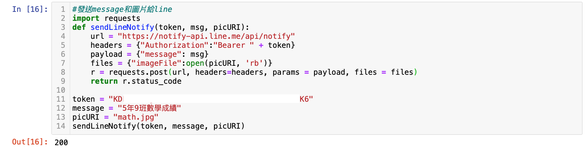

### 5. line接收到訊息和圖片
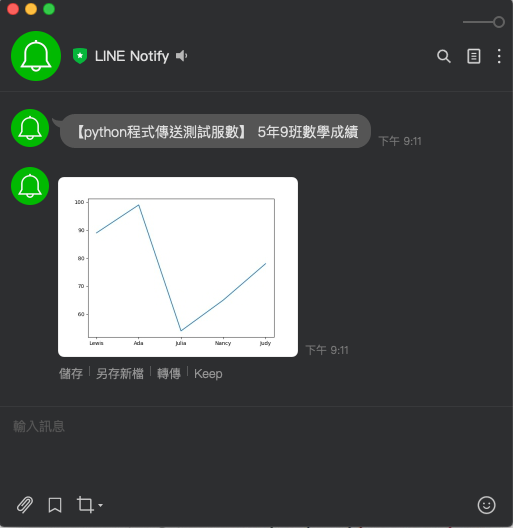


