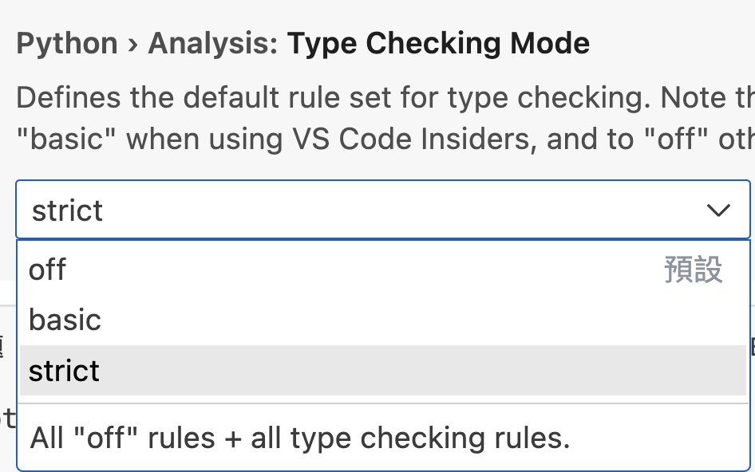
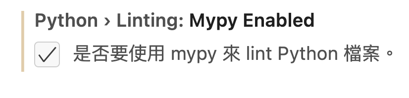
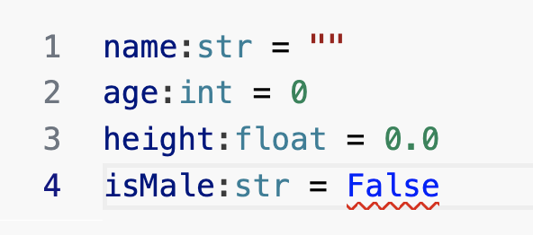
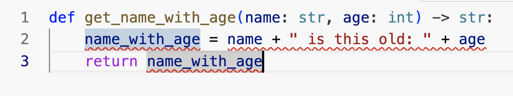

# python 型別提示(type hints)
- **python3.6**以後的版本支援(type hint)
- **python3.6**以上都有不同的支援方式如(union,optional,annotation)
- 本章僅介紹支援python10+

## python本質上還是動態型別
- 提示和檢查才是type hints的重點

## python 型別提示優點
- 讓開發者能了解每個變數的資料型別
- 提升開發工具的檢查型別功能和提示功能

## vscode IDE設定支援

### 提升python編輯器type檢查的功能

#### 1. 在設定內援尋**'type checking mode'**



#### 2. 在設定內援尋**'Mypy Enabled'**



## 宣告變數(一般)
- 基本型別str, bool, int, float

```python3.10
name = ""
age = 0
height = 0.0
isMale = False
```

## 宣告變數使用(type hint)

```python3.10
name:str = ""
age:int = 0
height:float = 0.0
isMale:bool = False
```

- vscode 檢查和驗證



## 定義function parameter (一般)

```python
def get_full_name(first_name, last_name):
    full_name = first_name.title() + " " + last_name.title()
    return full_name


print(get_full_name("john", "doe"))
```

### - 缺點


## 定義function parameter (type hints)

```python
def get_full_name(first_name:str, last_name:str) -> str:
    full_name:str = first_name.title() + " " + last_name.title()
    return full_name


print(get_full_name("john", "doe"))
```

### - 優點


## 定義function parameter (type hints)
- function有錯誤,參數age是int
- 利用vscode工具的檢查功能

```python3.10
#錯誤
def get_name_with_age(name: str, age: int) -> str:
    name_with_age = name + " is this old: " + age
    return name_with_age
```

```python3.10
#正確
def get_name_with_age(name: str, age: int) -> str:
    name_with_age:str = name + " is this old: " + str(age)
    return name_with_age
```

### - 優點


## 使用簡單型別

```
def get_items(item_a: str, item_b: int, item_c: float, item_d: bool, item_e: bytes)->tuple[str,int,float,bool,bytes]:
    return item_a, item_b, item_c, item_d, item_e
```

## Generic types with type parameters(泛型)
- python 基本資料結構(list,dict,tuple,set)內所要求的型別
- 3.6以上可以使用 from typing image List
- 3.6以上可以使用 List[str]
- 3.10直接使用list[str] 

```
#3.6以上
from typing import List
def process_items(items: List[str]) -> None:
    for item in items:
        print(item)
```

```
#3.10以上使用
def process_items(items: list[str]) -> None:
    for item in items:
        print(item)
```

### list,tuple,set,dict的type hints

```
#3.10以上使用
list[str]
tuple[int, int, str]
set[int]
dict[str,str]
```

```
#3.10以上使用
def process_items(items: list[str]):
    for item in items:
        print(item)
```

```
#3.10以上使用
def process_items(prices: dict[str, float]) -> None:
    for item_name, item_price in prices.items():
        print(item_name)
        print(item_price)
```

```
#3.10以上使用
def process_items(items_t: tuple[int, int, str], items_s: set[bytes]) -> tuple[tuple[int, int, str], set[bytes]]:
    return items_t, items_s
```


## union
- 一個變數定義2個以上的變數

```
#python3.10+
def process_item(item: int | str) -> None:
    print(item)
```

```
#python3.6+
from typing import Union

def process_item(item: Union[int, str]) -> None:
    print(item)
```


### 變數有可能是None

```python
#python3.6+
from typing import Optional

def say_hi(name: Optional[str] = None) -> None:
    if name is not None:
        print(f"Hey {name}!")
    else:
        print("Hello World")

```


```python
#python3.6+
from typing import Union


def say_hi(name: Union[str, None] = None) -> None:
    if name is not None:
        print(f"Hey {name}!")
    else:
        print("Hello World")
```


```python
#python3.10+
def say_hi(name: str | None = None) -> None:
    if name is not None:
        print(f"Hey {name}!")
    else:
        print("Hello World")
```

```python
#python3.10+
def say_hi(name: str | None) -> None:
    print(f"Hey {name}!")

say_hi("robert")
say_hi(name="robert")

=======結果

Hey robert!
Hey robert!
```


```python
#python3.10+

def say_hi(name: str | None = None) -> None:
    if name is None:
        print("Hey")
    else:
        print(f"Hey {name}!")

say_hi()
say_hi("robert")
say_hi(name="robert")

=========結果
Hey
Hey robert!
Hey robert!
```

## Classes as types(使用自訂型別)

```python
class Person:
    def __init__(self, name: str):
        self.name = name

john:Person = Person("john")


def get_person_name(one_person: Person) -> str:
    return one_person.name

print(get_person_name(one_person=john))

===========結果
john
```


