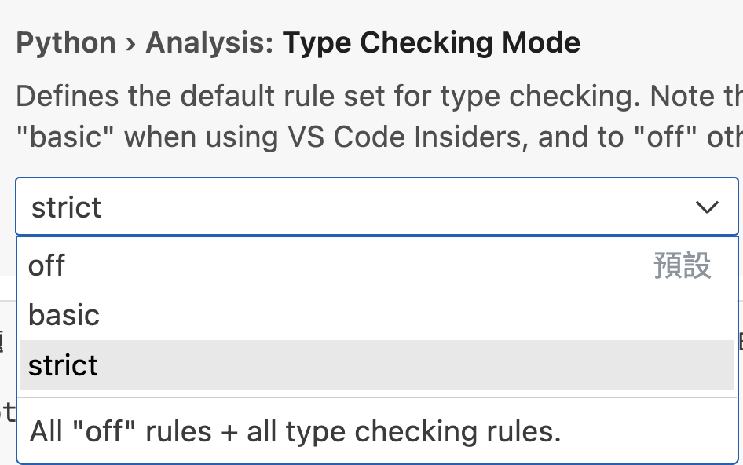
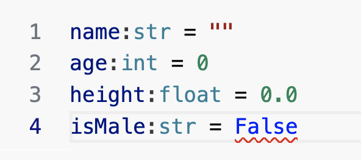
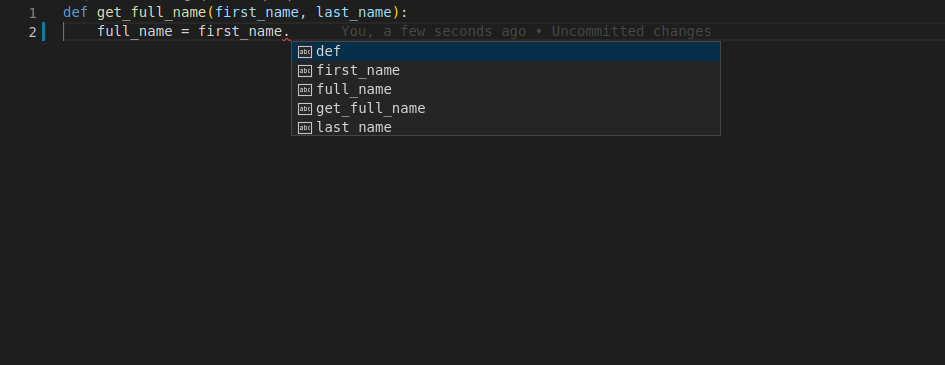
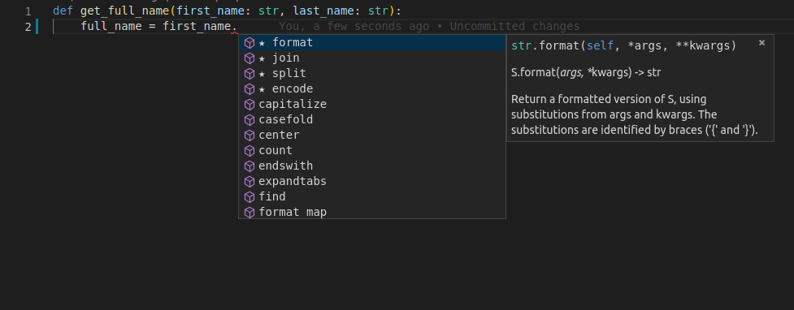
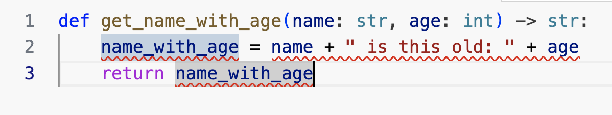

# Python 型別提示 (Type Hints)

Python 是一門**動態型別語言**。這意味著我們在宣告變數時，不需要事先指定它的型別，變數的實際型別是在程式執行時期（Runtime）被指派值的那一刻才決定的。

動態型別讓開發變得非常快速靈活，但在開發大型專案、建構 API，或使用資料驗證套件時，動態型別也容易帶來隱患——例如，不小心將字串與整數相加、或是拼錯變數屬性名稱。

為了解決這些痛點，Python 自 3.5 版本起引入了**型別提示 (Type Hints)** 語法。

---

## 1. 為什麼需要型別提示？

型別提示**不會改變** Python 作為動態型別語言的本質（Python 在執行時期依然不會因為您宣告了錯誤的型別提示而主動崩潰），但它能帶來以下 3 大核心優點：

1. **提升 IDE 自動補齊與提示體驗**：編輯器能明確知道變數的型別，並提供該型別專屬的方法提示，極大地減少拼字錯誤。
2. **靜態分析工具提前攔截錯誤**：在執行程式前，利用檢查工具（如 VS Code 內建的 Pylance）就能提前在編譯期間指出潛在的型別衝突。
3. **資料驗證套件的根基 (如 Pydantic)**：現代 Python 熱門套件 **Pydantic**（常用於 FastAPI 等 Web 框架）高度依賴 Python 內建的 Type Hints 來做執行時期的資料驗證與自動轉型。

### 🛠️ VS Code IDE 環境設定
為了讓編輯器發揮最強大的型別檢查功能，建議在 VS Code 中開啟靜態型別檢查模式：

#### 1. 設定 'Type Checking Mode'
開啟設定，搜尋 `type checking mode`，將其設定為 `basic` 或是 `strict`（嚴格模式）：


#### 2. 設定 'Mypy Enabled'
您也可以搭配 Mypy 靜態分析工具進行更深度的型別檢查：


---

## 2. 基礎型別提示 (Basic Type Hints)

基礎型別提示主要針對 Python 的內建基本資料型別：`str` (字串)、`int` (整數)、`float` (浮點數)、`bool` (布林值)。

### 2.1 變數的型別宣告
在變數名稱後方加上冒號 `: 型別`，隨後進行指派。
```python
# 宣告基本型別的型別提示
name: str = "羅伯特"
age: int = 40
height: float = 175.5
is_teacher: bool = True
```
如果您的 VS Code 開啟了型別檢查，當您嘗試指派一個不符合型別提示的值時，編輯器會顯示波浪底線警告：


---

### 2.2 函式參數與回傳值提示
在定義函式時，可以針對每個參數進行型別提示，並使用 `->` 宣告該函式預期的回傳值型別。

#### 💡 操作範例 1：姓名組合函式
```python
# 加上參數與回傳值提示
def get_full_name(first_name: str, last_name: str) -> str:
    full_name: str = first_name.title() + " " + last_name.title()
    return full_name

print(get_full_name("john", "doe"))  # 輸出: John Doe
```

##### 🌟 提示體驗差異：
* **無型別提示時**：當您在呼叫變數方法（例如 `.title()`）時，VS Code 無法提供自動補齊，並會顯示參數為 `Unknown`。
  
* **有型別提示時**：IDE 可以完美辨識參數為 `str`，並主動提示該型別所有可用的方法。
  

---

#### 💡 操作範例 2：年齡拼接防錯範例
當我們嘗試直接將字串與整數拼接時，常會因為忘記轉型而引發錯誤。型別提示能幫助 IDE 提前發現這個潛在的 Bug。

##### ❌ 錯誤程式碼 (IDE 會提示警告)：
```python
def get_name_with_age(name: str, age: int) -> str:
    # 警告！ age 變數是 int，不可以直接與字串 (str) 進行相加
    name_with_age = name + " is this old: " + age
    return name_with_age
```
在 VS Code 中，IDE 會在 `age` 上標記紅線警告（`TypeError`）：


#####  正確程式碼：
```python
def get_name_with_age(name: str, age: int) -> str:
    # 正確寫法：將 age 轉換為 str 後再拼接
    name_with_age: str = name + " is this old: " + str(age)
    return name_with_age
```

---

## 3. 容器型別提示 (Collection Type Hints)

除了單一變數外，我們也常需要為 Python 的內建資料結構（如串列、字典、元組）指定內含元素的型別。

> [!IMPORTANT]
> **Python 3.9 以上版本**支援直接使用小寫的內建型別 `list`、`dict`、`tuple`、`set` 來進行泛型宣告。
> 舊版本（Python 3.8 及以下）則必須從 `typing` 模組匯入大寫的 `List`、`Dict`、`Tuple`、`Set`。

### 3.1 串列與字典宣告對比
```python
# 1. 串列 (List)
# Python 3.9+ 寫法：
names: list[str] = ["愛麗絲", "鮑伯"]

# Python 3.8 及以下舊寫法：
# from typing import List
# names: List[str] = ["愛麗絲", "鮑伯"]

# 2. 字典 (Dict)
# Python 3.9+ 寫法 (Key為字串，Value為浮點數)：
prices: dict[str, float] = {"蘋果": 35.0, "香蕉": 15.5}
```

### 3.2 函式中的容器型別提示

#### 💡 範例 1：遍歷字串串列
```python
def process_items(items: list[str]) -> None:
    # 編輯器會明確知道 item 是一個 str，並提供字串方法的提示
    for item in items:
        print(item.upper())
```

#### 💡 範例 2：處理商品價格字典
```python
def print_prices(prices: dict[str, float]) -> None:
    for item_name, item_price in prices.items():
        print(f"商品: {item_name}, 價格: {item_price} 元")
```

#### 💡 範例 3：元組與集合的提示
```python
# 元組 (Tuple)：必須對應每個欄位的型別
# 集合 (Set)：指定內含所有元素的單一型別
def process_data(items_t: tuple[int, int, str], items_s: set[bytes]) -> tuple[tuple[int, int, str], set[bytes]]:
    return items_t, items_s
```

---

## 4. 複合與可選型別提示 (Union & Optional)

當一個變數或參數可能擁有多於一種的型別，或者值有可能為 `None` 時，我們需要使用 Union 或 Optional 宣告。

### 4.1 Union 聯合型別 (多選一)
* **Python 3.10+**：直接使用 `|` 管道符號，語法最為簡潔直觀。
* **Python 3.9 及以下**：必須從 `typing` 匯入 `Union`。

```python
# Python 3.10+
def process_item(item: int | str) -> None:
    print(f"處理資料: {item}")

# Python 3.9 及以下
# from typing import Union
# def process_item(item: Union[int, str]) -> None:
#     print(item)
```

---

### 4.2 Optional 可選型別 (可能為 None)
當一個變數的預設值為 `None`，或者可能不傳入資料時，必須標註它可能是 `None`。
在 Python 3.10+ 中，最標準的寫法是 `型別 | None`。

```python
# 1. Python 3.10+ 推薦寫法：使用 | None
def say_hi(name: str | None = None) -> None:
    if name is None:
        print("哈囉，世界")
    else:
        print(f"嘿！ {name}!")

say_hi()          # 輸出: 哈囉，世界
say_hi("羅伯特")   # 輸出: 嘿！ 羅伯特!
```

```python
# 2. Python 3.9 以前的 Optional 寫法：
# from typing import Optional
# def say_hi(name: Optional[str] = None) -> None:
#     ...
```

---

## 5. 自訂類別型別提示 (Classes as Types)

我們也可以直接將自訂的 `class` 類別名稱，作為型別提示的宣告。這在物件導向開發中非常實用。

```python
class Person:
    def __init__(self, name: str):
        self.name = name

# 宣告 john 變數的型別為 Person 類別的實體
john: Person = Person("john")

# 限制 one_person 參數必須為 Person 物件
def get_person_name(one_person: Person) -> str:
    return one_person.name

print(get_person_name(one_person=john))  # 輸出: john
```

---

## 6. 接軌未來：為什麼 Pydantic 需要型別提示？

在未來的章節中，您將會學習 **`Pydantic`** 套件。
Pydantic 是一個極其強大的資料驗證與設定管理庫。它最神奇的地方在於：**它完全利用了 Python 的 Type Hints，在程式執行時期（Runtime）自動為您進行型別校驗和資料自動轉型（Coercion）**。

### 💡 搶先看：Pydantic BaseModel 範例
當我們使用 Pydantic 時，只需要定義型別提示，Pydantic 就能幫我們完成所有的轉型與校驗：

```python
from datetime import datetime
from pydantic import BaseModel

# 定義一個 User 類別，繼承自 Pydantic 的 BaseModel
# 這裡使用的全部都是 Python 原生的型別提示語法！
class User(BaseModel):
    id: int
    name: str = "John Doe"
    signup_ts: datetime | None = None
    friends: list[int] = []

# 我們輸入的外部資料 (例如來自 API 的 JSON 請求)，型別往往是凌亂的 (如字串、bytes)
external_data = {
    "id": "123",                    # 傳入的是字串 "123"
    "signup_ts": "2026-07-01 12:22", # 傳入的是日期字串
    "friends": [1, "2", b"3"],      # 列表中混雜了字串 "2" 與位元組 b"3"
}

# Pydantic 實體化
user = User(**external_data)

# 1. 觀察轉型結果
print(user)
# 輸出: User id=123 name='John Doe' signup_ts=datetime.datetime(2026, 7, 1, 12, 22) friends=[1, 2, 3]

# 2. 字串 "123" 自動被轉換成整數 123
print(type(user.id))  # 輸出: <class 'int'>

# 3. 陣列中的 "2" 與 b"3" 自動被轉換成整數 2 與 3
print(user.friends)   # 輸出: [1, 2, 3]
```

### 🧠 重點提示：
* **資料自動轉型 (Type Coercion)**：即使傳入的資料型別不對，只要能夠被合理轉換（例如 `str` 的 `"123"` 轉為 `int`，或是 `str` 的日期轉為 `datetime`），Pydantic 都會依據您寫下的 **Type Hint** 自動轉換完成，不需您手動撰寫 `int()` 或 `datetime.strptime()`。
* **資料校驗 (Validation)**：若傳入無法轉型的資料（例如將 `id` 給予文字 `"hello"`），Pydantic 會在執行時期立刻拋出詳細的錯誤報告，精準攔截問題。

因此，**寫好 Type Hint，不僅是為了 IDE 的提示功能，更是讓 Pydantic 幫您防錯並打通資料流的關鍵起點！**
