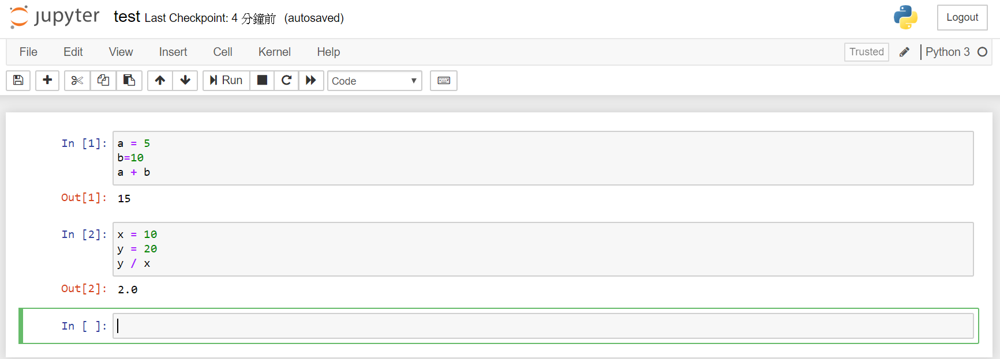

# python基礎 

## Microsoft Azure noteboot(雲端編輯器)
[Azure notebook](https://notebooks.azure.com/)

## Google Colab(雲端編輯器)
[Google Colab](https://colab.research.google.com/notebooks/intro.ipynb)

## 安裝pycharm (本地端編輯器)
[安裝pycharm community](https://www.jetbrains.com/pycharm/)  

## anaConda(本地虛擬環境編輯器)
[本地編輯器](https://www.anaconda.com/)

## python 編譯器語言
python是編譯器語言,由上而下,一次只執行一行程式  

### 使用command line的視窗方式執行python語言  
```python
$ python
Python 3.6.0 | packaged by conda-forge | (default, Jan 13 2017, 23:17:12) [GCC 4.8.2 20140120 (Red Hat 4.8.2-15)] on linux
Type "help", "copyright", "credits" or "license" for more information.  
>>> a = 5  
>>> print(a)  
5

使用exit()或按下Ctrl-D來離開python Shell模式
```

### 使用可以互動的Ipython Shell的方式
```python
#檢查pip的版本,驗證是python 3.7版的package管理
$ pip --version
pip 20.0.2 from C:\Users\roberthsu2003\Anaconda3\envs\project1\lib\site-packages\pip (python 3.7)


#查看目前python環境所有的packages
$pip list
Package      Version
------------ -------------------
certifi      2019.11.28
pip          20.0.2
setuptools   45.1.0.post20200127
wheel        0.34.1
wincertstore 0.2


#安裝IPpipython
$pip install ipython
Installing collected packages: decorator, pygments, wcwidth, prompt-toolkit, colorama, pickleshare, backcall, six, ipython-genutils, traitlets, parso, jedi, ipython
Successfully installed backcall-0.1.0 colorama-0.4.3 decorator-4.4.1 ipython-7.12.0 ipython-genutils-0.2.0 jedi-0.16.0 parso-0.6.0 pickleshare-0.7.5 prompt-toolkit-3.0.3 pygments-2.
5.2 six-1.14.0 traitlets-4.3.3 wcwidth-0.1.8

#執行ipython
$ ipython
In [1]: a = 5

In [2]: a
Out[2]: 5

In [3]: a?
Type:        int
String form: 5
Docstring:
int([x]) -> integer
int(x, base=10) -> integer


使用exit()或按下Ctrl-D來離開python Shell模式
```

### 使用ipython + jupyter notebook
```python
#安裝jupyter notebook
$pip install notebook

#執行jupyter notebook
$jupyter notebook
```



### 使用pycharm建立並執行xxx.py檔執行python

```python
#建立hello_world.py

#輸入
print("Hello! Python.")

#執行hello_world.py
C:\Users\roberthsu2003\Anaconda3\envs\project1\python.exe C:/Users/roberthsu2003/Documents/pycharm/project1/hello_world.py
Hello! Python.
```

## 關於變數

1. 關於變數宣告:
	* 其他程式語言的變數需要先進行宣告，告訴作業系統它的名稱與它的型態。
	* Python 變數不需要經過宣告就可以使用。
	
2. 變數必須透過 = 給值後才可以使用，= 代表右邊資料交給左邊。
	* 變數名稱 = 變數內容

	* 例如建立一個名為 openedx 的變數，內容為 100:

```python
openedx=100
```
	
3. 程式執行時需要儲存，這個儲存的對象就是變數，這是我們自己定義
的名稱。

4. 變數有整數、浮點數、字串與布林這四種，整數與浮點數是不同喔!

5. Python 的變數為何沒有型態的限制?

6. Python 的變數其實也是物件的一種，只是這些物件就跟其他程式語 言一樣只操作指定型態的資料。

7. 可以在同一列中指定多個變數，變數之間以「,」分隔，而內容之間 也以「,」分隔。

8. 例如建立變數 pcschool 內容為台灣，years 內容為 2018

```python
taiwan, years = '台灣’, 2018
```

9. 如果不使用變數可以選擇以 del 語法將變數刪除以節省記憶體。
	- 例如刪除 years 變數，那操作方式為:

```python
del years
```


## 變數命名的規則
- 開頭第一個字不能是數字。
- 可使用大小寫字母或「_」。
- 不可與內建保留字 (右邊表格所列) 同名。
- Python 3 可以使用中文名稱。
- 大小寫視為不同的變數。
- 不可以出現特殊字元或空白。


## 合法命名  

```
• a  
• a1  
• a_b_c___95  
• _abc  
• _1a  
```
## 不合法命名  

```
• 1 
• 1a  
• 1_  
```
### question: 請問以下哪一個變數命名是錯的?(選擇題)
(1) 5well.  
(2) pcschool  
(3) 巨匠  

---

### question: 請問以下哪一個變數命名是錯的?(複選題)

(1) 7eleven  
(2) pcschool&python  
(3) Pcschool python  
(4) if  

---

### question: 若要建立 x 變數內容為 15，請問哪一行是對的? (選擇題)
(1) x equals 15   
(2) x is 15  
(3) 15 = x  
(4) x = 15 

---

## 關於註解
- 註解就是程式的說明文字
- 單行註解，可於程式碼中加入「#」作為單行註解，於「#」之後的該行語法都不會執行。
	- pcschool=100   #pcschool 儲存 100 這個內容
- 多行註解，可於註解區塊前後加上三個單引號或三個雙引號方式。 

--- 

## 變數給值與輸出  
- 如何給值?
	- 請使用「=」這個符號，「=」代表右邊丟給左邊，而左邊得接受這個資料。
- 在建立變數之前，也就是給變數內容之前，嘗試存取某個變數會發生變 數未定義的錯誤。
- print 代表資料輸出，也是存取內容的動作，基本語法為 print(變數) 或者 print(內容)。
- 內容會被雙引號或者單引號包夾起來。

###  question:關於輸出語法哪一個是對的?(選擇題)
(1) print 3 + 4   
(2) print(3 + 4)   
(3) print 3 + 4   
(4) put(3 + 4)  

---

###  question:請問 Python 檔案副檔名哪一個是對的?(選擇題)
(1) .script  
(2) .pyscript   
(3) .py  
(4) .python  

---

###  question: 請問執行這一行後的說明哪一個是對的?(選擇題)
```python
print(x1)
```
(1) 產生錯誤  
(2) 輸出空白  
(3) 輸出 0 

--- 

###  question: 請問執行後的說明哪一個是對的?(選擇題)
```python
x=50 
x='test' 
print(x)
```
(1) 產生錯誤  
(2) 輸出 test  
(3) 輸出 5  

---

## Python內建資料型別
- Python 的變數並沒有設定固定型態。
- 變數型態有整數、浮點數、布林值、字串。 

• booleans (True or False)  
• integers (42 and 100000000)  
• floats (3.14159）  
• string  


|-|-|
|:--|:--|
| var1=20 |  var1 是整數，也就是 int 型態。|
| var2=123.45 | var2 是浮點數，也就是 float 型態。 |
| var3 | var3 是布林值，也就是 True 或者 False。 |
|  var4=‘string1’ |  var4 是字串 string，可用單引號或雙引號包起來。|
 
##  資料型態
- 如何知道變數的資料型態?
	- 可使用 type( ) 指令顯示。
- 變數內容變更後會儲存於不同的記憶體位址。那要如何查詢位址呢?
	- 可使用 id( ) 指令顯示。


```python
#下面2行，將7給變數a, 並且輸出變數a的內容
>>> a=7
>>> print(a)

#將a的參考給b,並且輸出變數b的內容
>>> b=a
>>> print(b)

#使用type function輸出目前的資料型別
>>> type(a) 
<class 'int'>

>>> type(b)
<class 'int'>

>>> type(58)
<class 'int'>

>>> type(99.9)
<class 'float'>

>>> type('abc')
<class 'str'>

```

### 資料型態:請動手操作，並留意輸出結果(type1.py)
```python
var1=20 
print(type(var1))
var2=123.45
print(type(var2))
var3=True print(type(var3)) 
var4='string1' print(type(var4)) 
```

### 資料型態:請動手操作，並留意輸出結果(type2.py)
```python
a=5
a=20
print(id(a))
a="test" 
print(id(a)) 
```

###  question:請問執行這兩行後記憶體位址會相同嗎?(選擇題)
```python
a=5.4
a=20.3
```
(1) 相同  
(2) 不同  

---

## python數學運算子

運算子 | 描述  | 範例
-----| ------- | ----
| + | 加法 | 5+8=13
| - | 減法 | 90-10=80  
| * | 乘法 | 4*7=28
| / | 浮點數除法 | 7 / 2=3.5
| // | 整數除法 | 7 // 2 = 3
| % | 餘數  | 7 % 3 = 1
| ** | 次方 |  3 ** 4 = 81

--- 
## python的整數

```python
>>> 5
5

>>> 0
0

#數字前不可以加0
>>> 05
      File "<stdin>", line 1
05
^
SyntaxError: invalid token #python的語法錯誤


#正整數
>>> 123
    123
>>> +123
    123
    
#負整數
>>> -123 
-123

#整數運算
>>>5+9 
   14 
>>>100-7 
   93 
>>>4-10 
   -6
   
#多個數值運算
>>>5+9+3
17 
>>>4+3-2-1+6 
	 10
	 
#乘法運算
>>>6*7
42
>>>7*6
42 
>>>6*7*2*3 
   252
   
#浮點數除法
>>>9/5 
   1.8

#整數除法
>>>9//5 
   1
#除數不可以為零
>>>5/0
Traceback (most recent call last):
File "<stdin>", line 1, in <module> ZeroDivisionError: division by zero >>>7//0
Traceback (most recent call last):
File "<stdin>", line 1, in <module> ZeroDivisionError: integer division or modulo by z


#變數可以運算
>>>a=95 
>>> a
95 
>>>a-3 
   92

#將變數自已的內容減3   
>>>a=a-3 
>>> a
92

>>>a=95 
>>>temp=a-3 
>>>a=temp

#上面敘述式，可以使用下面這行替代
>>>a=a-3

#餘數
>>>9%5 
   4
   
>>> divmod(9,5)
    (1, 4)

>>> 9//5 
   1 
>>> 9%5 
   4


```

## 優先運算子

```python
>>>2+3*4 
   14
   
>>>(2+3)*4
   20
   
```

## 2,8,16進位
表示 | 進位
--- | ---
0b 0B | 2進位
0o 0O | 8進位
0x 0X | 16進位

```python
#10進位
>>> 10 
10

#2進位
>>> 0b10
2

#8進位
>>> 0o10
8

#16進位
>>> 0x10
16

```

## 類型轉換

```python
>>> int(True)
    1
>>> int(False)
    0
 
 
    
>>> int(98.6) 
    98
>>> int(1.0e4) 
    10000
 
  
    
>>> int('99') 
    99
>>> int('-23') 
    -23
>>> int('+12')
    12


>>> int(12345)
    12345


>>> int('99 bottles of beer on the wall')
Traceback (most recent call last):
File "<stdin>", line 1, in <module>
ValueError: invalid literal for int() with base 10: '99 bottles of beer on the wall' >>> int('')
Traceback (most recent call last):
File "<stdin>", line 1, in <module>
ValueError: invalid literal for int() with base 10: ''


>>> int('98.6')
Traceback (most recent call last):
File "<stdin>", line 1, in <module>
ValueError: invalid literal for int() with base 10: '98.6' >>> int('1.0e4')
Traceback (most recent call last):
File "<stdin>", line 1, in <module>
ValueError: invalid literal for int() with base 10: '1.0e4'


>>>4+7.0 
   11.0
   

>>>True+2
    3
>>> False + 5.0 
    5.0
```

## int的範圍

```kotlin
>>>
>>> googol = 10**100
>>> googol
   100000000000000000000000000000000000000000000000000000000000000000000000000000
00000000000000000000000

>>> googol * googol
    100000000000000000000000000000000000000000000000000000000000000000000000000000000000000000000000000000000000000000000000000000000000000000000000000000000000000000000000000000000000000000000000000000000


    
```

## float浮點數

```python
>>> float(True) 
    1.0
>>> float(False)
    0.0

>>> float(98) 
    98.0
>>> float('99') 
    99.0

    

>>> float('98.6')
    98.6
>>> float('-1.5')
    -1.5
>>> float('1.0e4')
    10000.0


```

## 字串

```python
>>> 'Snap'
    'Snap'
>>> "Crackle"
    'Crackle'


>>> "'Nay,' said the naysayer."
"'Nay,' said the naysayer."
>>> 'The rare double quote in captivity: ".'
'The rare double quote in captivity: ".'
>>> 'A "two by four" is actually 1 1⁄2" × 3 1⁄2".'
'A "two by four is" actually 1 1⁄2" × 3 1⁄2".'
>>> "'There's the man that shot my paw!' cried the limping hound." "'There's the man that shot my paw!' cried the limping hound."
 


>>> '''Boom!'''
    'Boom'
>>> """Eek!"""
    'Eek!'
    
>>> poem = '''There was a Young Lady of Norway, ... Who casually sat in a doorway;
... When the door squeezed her flat,
... She exclaimed, "What of that?"
... This courageous Young Lady of Norway.'''


>>> poem2 = '''I do not like thee, Doctor Fell.
... The reason why, I cannot tell.
... But this I know, and know full well:
... I do not like thee, Doctor Fell.
... '''
>>> print(poem2)
I do not like thee, Doctor Fell.
	The reason why, I cannot tell.
	But this I know, and know full well: 
	I do not like thee, Doctor Fell.
>>>


>>> print(99, 'bottles', 'would be enough.') 
    99 bottles would be enough.
    
    

>>> ''
    ''
>>> ""
    ''
>>> ''''''
    ''
>>> """"""
    ''
>>>


>>> bottles = 99
>>> base = ''
>>> base += 'current inventory: '
>>> base += str(bottles)
>>> base
    'current inventory: 99'


#使用str()轉換為字串型別
>>> str(98.6) 
    '98.6'
>>> str(1.0e4) 
    '10000.0'
>>> str(True)
    'True'


#脫溢字元 \
>>> palindrome = 'A man,\nA plan,\nA canal:\nPanama.' 
>>> print(palindrome)
A man,
A plan,
A canal: Panama.


>>> print('\tabc') 
    abc
>>> print('a\tbc') 
    a bc
>>> print('ab\tc') 
    ab c
>>> print('abc\t') 
    abc


>>> testimony = "\"I did nothing!\" he said. \"Not that either! Or the other thing.\""
>>> print(testimony)
"I did nothing!" he said. "Not that either! Or the other thing."
>>> fact = "The world's largest rubber duck was 54'2\" by 65'7\" by 105'" 
>>> print(fact)
The world's largest rubber duck was 54'2" by 65'7" by 105'


>>> speech = 'Today we honor our friend, the backslash: \\.' 
>>> print(speech)
Today we honor our friend, the backslash: \.


# 使用+運算子
>>> 'Release the kraken! ' + 'At once!'
    'Release the kraken! At once!'


>>> a = 'Duck.' 
    b=a
>>> c = 'Grey Duck!' 
>>>a+b+c 
   'Duck.Duck.Grey Duck!'


>>> print(a, b, c) 
    Duck. Duck. Grey Duck!
    
```


### question:以下的資料輸出哪一個是錯的?(選擇題)
(1) "I can add integers, like " + str(5) + " to strings."  
(2) "Isaid"+("Hey"*2)+"Hey!"  
(3) "The correct answer to this multiple choice exercise is answer number" + 2  
(4) True + False  

---
 
### question:請問執行後的說明哪一個是對的?(選擇題)
```python
a,b,c="pcschool",2016,3.41
print(b)
```
(1) 2016  
(2) 3.41  
(3) pcschool  

---


###  請問執行後的說明哪一個是對的?(選擇題)
```python
test=("abc"+"!")*2
print(test)
```
(1) abc!2  
(2) abc! abc!
(3) abc+!*2

---
