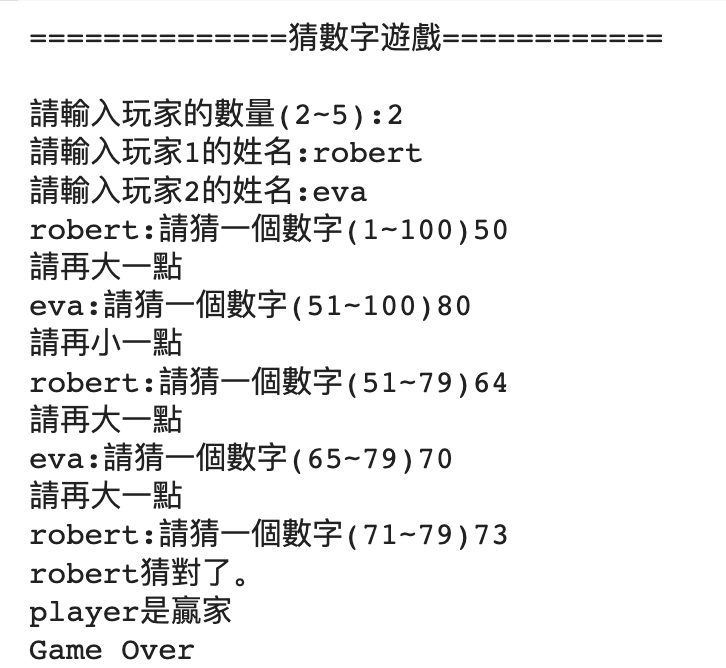
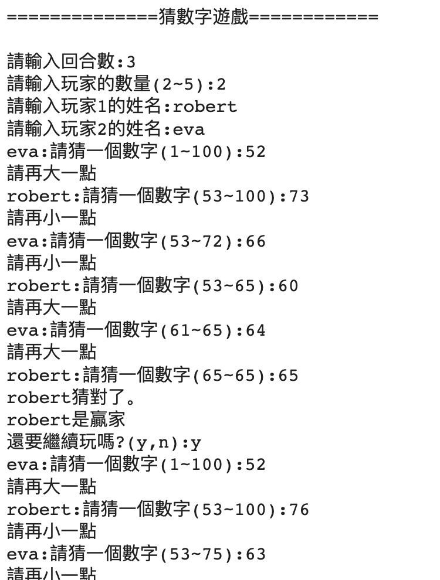

# 小遊戲

### 畢氏定理

```python
import cmath
對邊 = int(input("請輸入對邊:"))
鄰邊 = int(input("請輸入鄰邊:"))
斜邊 = cmath.sqrt(對邊 ** 2 + 鄰邊 ** 2)
print("斜邊=",斜邊.real)
```


### 三角函數計算角度(對邊,斜邊)
```python
import cmath
對邊 = int(input("請輸入對邊:"))
斜邊 = int(input("請輸入斜邊:"))
角度 = cmath.asin(對邊 / 斜邊) * 180 / cmath.pi
print("角度:",角度.real)
```

### 三角函數計算角度(角度,斜邊)

```python
import cmath
角度 = int(input("請輸入角度:"))
斜邊 = int(input("請輸入斜邊:"))
對邊 = cmath.sin(角度/180*cmath.pi) * 斜邊
print("對邊:",對邊.real)
```

### 加法遊戲

```python
import random
first = random.randint(1,100)
second = random.randint(1,100)
answer = float(input(f"{first}+{second}="))

if answer == (first + second):
  print("恭喜!答對了")
else:
  print("您錯了!")
  print(f"答案是{first+second}")
```


### 乘法遊戲

```python
import random
first = random.randint(1,100)
second = random.randint(1,100)
answer = float(input(f"{first}*{second}="))

if answer == (first * second):
  print("恭喜!答對了")
else:
  print("您錯了!")
  print(f"答案是{first*second}")
```

### 猜數字遊戲

```python
import random
min = 1
max = 100
count = 0

target = random.randint(1, 100)
#print(target)

print("============猜數字遊戲===================\n\n")
while(True):
  keyin = int(input(f"猜數字的範圍{min}~{max}:"))
  count += 1
  if keyin >= min and keyin <= max:
    if keyin == target:
      print("您答對了")
      print(f"您猜了{count}次")
      break
    elif (keyin > target):
      print("再小一點")
      max = keyin
    elif(keyin < target):
      print("再大一點")
      min = keyin
    print(f"您猜了{count}次")
  else:
    print("請輸入提示範圍內的數字")

```

### 剪刀石頭布遊戲

```python
from IPython.display import clear_output
import random

玩家1 = []
name1 = input("請輸入玩家1的姓名:")
玩家1.append(name1)
print(玩家1)

玩家2 = []
name2 = input("請輸入玩家2的姓名:")
玩家2.append(name2)
print(玩家2)
for i in range(1,6):
  手示1=int(input(f"{玩家1[0]},請出第{i}次手示:(1:剪刀,2:石頭,3:布)"))
  玩家1.append(手示1)
clear_output()

for i in range(1,6):
  手示2=int(input(f"{玩家2[0]},請出第{i}次手示:(1:剪刀,2:石頭,3:布)"))
  玩家2.append(手示2)
clear_output()

print(玩家1)
print(玩家2)

結果 = []

for i in range(1,6):
  手示1 = 玩家1[i]
  手示2 = 玩家2[i]

  if(手示1==1):
    if(手示2==1):
      結果.append("平手")
    elif(手示2==2):
      結果.append(玩家2[0])
    elif(手示2==3):
      結果.append(玩家1[0])

  elif(手示1==2):
    if(手示2==1):
      結果.append(玩家1[0])
    elif(手示2==2):
      結果.append("平手")
    elif(手示2==3):
      結果.append(玩家2[0])
  elif(手示1==3):
    if(手示2==1):
      結果.append(玩家2[0])
    elif(手示2==2):
      結果.append(玩家1[0])
    elif(手示2==3):
      結果.append("平手")

print(結果)

玩家1贏次數=0
玩家2贏次數=0
平手次數=0
for item in 結果:
  if 玩家1[0] == item:
    玩家1贏次數 +=1;
  elif 玩家2[0] == item:
    玩家2贏次數 +=1;
  else:
    平手次數 += 1;

print(f"{玩家1[0]}贏次數:{玩家1贏次數}")
print(f"{玩家2[0]}贏次數:{玩家2贏次數}")
print(f"平手次數:{平手次數}")


```

### 過關遊戲

```python
from IPython.display import clear_output
from time import sleep

current_index = 0
nums = 0
while True:  
  input("請執行:")
  clear_output()
  sleep(1)
  nums += 1
  value = random.randint(1,6)
  current_index += value
  if(current_index >= 49):
      break;
  while grid[current_index] != 0:
    current_index += grid[current_index]
    
  print(current_index)

print("過關")
print(f"您使用了次數:{nums}")
```

### 骰子遊戲

```python
#骰子
import random
from IPython.display import clear_output
from time import sleep

def dice():
  x1=random.randint(1,6)
  x2=random.randint(1,6)
  x3=random.randint(1,6)
  x4=random.randint(1,6)
  print(x1,x2,x3,x4)
  scores=0

  #4骰子一樣
  if(x1==x2==x3==x4):
    scores=(x1+x2+x3+x4)*10

  elif(x1==x2==x3) or (x1==x2==x4) or (x2==x3==x4) or (x1==x3==x4):
    return None

  elif(x1==x2):
    if(x3 == x4):
      scores = max(x1+x2,x3+x4) 
    else:
      scores=x3+x4

  elif(x3==x4):
    if(x1 == x2):
      scores = max(x1+x2,x3+x4) 
    else:
      scores=x1+x2
    
  elif(x1==x3):
    if(x2 == x4):
      scores = max(x1+x3,x2+x4) 
    else:
      scores=x2+x4

  elif(x1==x4):
    if(x2 == x3):
      scores = max(x1+x4,x2+x3) 
    else:
      scores=x2+x3

  elif(x4==x2):
    if(x1 == x3):
      scores = max(x1+x3,x2+x4) 
    else:
      scores=x1+x3

  elif(x3==x2):
    if(x1 == x4):
      scores = max(x2+x3,x1+x4) 
    else:
      scores=x1+x4
  else:  
    return None

  return scores

def playGame():
  bet = eval(input("本次賭金為:"))
  input("請play1擲骰子:")
  play1 = dice()
  while play1 is None:
    input("請重新擲骰子:")
    play1 = dice()

  print(f"玩家1的分數是:{play1}\n\n")

  input("請play2擲骰子:")
  play2 = dice()
  while play2 is None:
    input("請重新擲骰子:")
    play2 = dice()

  print(f"玩家2的分數是:{play2}\n\n")

  if play1 == play2:
    print("平手")
  elif play1 > play2:
    print("玩家1:贏")
    marker[0] += bet

  else:
    print("玩家2:贏")
    marker[1] += bet

marker = [0,0]


while True:
  playGame()
  play_again = input("還繼續遊戲嗎?(y,n):")
  if play_again == 'n':
    break
  else:
    clear_output()
    sleep(1)


print("遊戲結束")
print(f"玩家1所得金額為:{marker[0]}")
print(f"玩家2所得金額為:{marker[1]}")

```

### 井字遊戲


```python
# 井字遊戲 
# 井字遊戲
# 1~最大數,先輸入最大數,最大數限制15~30
# 9個數值為1~最大數的亂數
# 輸入最少次數,完成連線者-勝


import random
from time import sleep 
from IPython.display import clear_output

def created_9grid():
  no_repeat = set()
  while(len(no_repeat) < 9):
    no_repeat.add(random.randint(1,max))
  no_repeat = list(no_repeat)

  outer = []
  for i in range(3):
    inter = []
    for j in range(3):
      inter.append(no_repeat.pop())
    outer.append(inter)
  
  return outer

def display_grid(outer):
  for inner in outer:
    for item in inner:
      print(f"{item:2d}",end="  ")
    print()

def display_hide_show(outer,selected):
  for inner in outer:
    for item in inner:
      if item in selected:
        print(f"{item:2d}",end="  ")
      else:
        print("__",end="  ")
    print()

def examine_line(source, selected):
  match=0
  for item in selected:
    if item in source:
      match += 1
  
  if match == 3:
    return True
  else:
    return False

def get_lines(outer, selected):
  lines = 0
  sourceline_groups = []
  sourceline = outer[0]
  sourceline_groups.append(sourceline)  
  sourceline = outer[1]
  sourceline_groups.append(sourceline)
  sourceline = outer[2]
  sourceline_groups.append(sourceline)
  sourceline = [outer[0][0], outer[1][0], outer[2][0]]
  sourceline_groups.append(sourceline)
  sourceline = [outer[0][1], outer[1][1], outer[2][1]]
  sourceline_groups.append(sourceline)
  sourceline = [outer[0][2], outer[1][2], outer[2][2]]
  sourceline_groups.append(sourceline)
  sourceline = [outer[0][0], outer[1][1], outer[2][2]]
  sourceline_groups.append(sourceline)
  sourceline = [outer[0][2], outer[1][1], outer[2][0]]
  sourceline_groups.append(sourceline)

  for source in sourceline_groups:
    if examine_line(source,selected) == True:
      lines += 1

  return lines


max = int(input("請輸入最大數(15~30):"))
if max < 15 or max > 30:\
  max = 30;
fixInputs= [i for i in range(1,max+1)]
inputs = []
grid = created_9grid()

while True:
  value = eval(input(f"請輸入{fixInputs}:"))
  if value > max or value not in fixInputs:
    print("輸入錯誤")
    continue
  fixInputs.remove(value)
  inputs.append(value)
  clear_output()
  sleep(1)
  display_hide_show(grid,inputs)
  lines = get_lines(grid,inputs)
  if lines > 0: 
    break

print(f"輸入{len(inputs)}數值,完成{lines}條線")
```

### 糖果遊戲
```python
#game:candy catch
#begin for game
#1. set player's name of players
# set number of player
#2. set candy numbers
#3. 設定每位玩家最多可以取得糖果的數量
#created by eva
#version1.1

player1 = input("請輸入玩家1的姓名:")
player2 = input("請輸入玩家2的姓名:")
player_nums = 2
candy_nums = int(input("請輸入糖果的數量:"))
catch_limit = int(input("請輸入玩家每次可取得糖果的數量:"))
nums = 1
while True:
  if nums % player_nums == 1:
    name = player1
  else:
    name = player2
  value = int(input(f"請{name}輸入取得糖果的數量(1~{catch_limit})"))
  if value <= catch_limit and value < candy_nums and value != 0:
    if (candy_nums - value) == 1:
      break
    else:
      candy_nums -= value
      print("===========================")
      print(f"candy numbers is {candy_nums}")
      nums += 1
  else:
    print("輸入錯誤!請重新輸入")
    continue
print(f"The winner is {name}")
nums += 1
if nums % player_nums == 1:
    name = player1
else:
    name = player2
print(f"The failer is {name}")
print("Game-Over")
```

### 猜數字遊戲

```python
#The maze of numbers
#version1.0

import random

def next_player(nums, players):
  players_nums = len(players)
  index = nums % players_nums
  return players[index]

print("==============猜數字遊戲============\n")
players = []
player_nums = int(input("請輸入玩家的數量(2~5):"))
for i in range(player_nums):
  name = input(f"請輸入玩家{i+1}的姓名:")
  players.append(name)

min = 1
if player_nums == 2:
  max = 100
elif player_nums == 3:
  max = 300
elif player_nums == 4:
  max = 500
elif player_nums == 5:
  max = 700


nums = random.getrandbits(8)
number_maze = random.randint(min,max)

while True:
  player_name = next_player(nums, players)
  input_value = int(input(f'{player_name}:請猜一個數字({min}~{max}):'))
  if input_value <= max and input_value >= min:
    #範圍正確
    if input_value == number_maze:
      print(f"{player_name}猜對了。")
      print(f"{player_name}是贏家")
      break;
    elif input_value < number_maze:
      print("請再大一點")
      min = input_value + 1
    elif input_value > number_maze:
      print("請再小一點")
      max = input_value - 1
  else:
    print("超出範圍,請下個玩家輸入")

  nums += 1
print("Game Over")
```



### 猜數字遊戲

```python
#The maze of numbers
#version2.0
#增加回合數

import random

def next_player(nums, players):
  players_nums = len(players)
  index = nums % players_nums
  return players[index]

def play_game(players,min,max):
  nums = random.getrandbits(8)
  number_maze = random.randint(min,max)

  while True:
    player_name = next_player(nums, players)
    input_value = int(input(f'{player_name}:請猜一個數字({min}~{max}):'))
    if input_value <= max and input_value >= min:
      #範圍正確
      if input_value == number_maze:
        print(f"{player_name}猜對了。")
        print(f"{player_name}是贏家")
        return player_name
      elif input_value < number_maze:
        print("請再大一點")
        min = input_value + 1
      elif input_value > number_maze:
        print("請再小一點")
        max = input_value - 1
    else:
      print("超出範圍,請下個玩家輸入")

    nums += 1
  


print("==============猜數字遊戲============\n")
round = int(input("請輸入回合數:"))
players = []
player_nums = int(input("請輸入玩家的數量(2~5):"))
for i in range(player_nums):
  name = input(f"請輸入玩家{i+1}的姓名:")
  players.append(name)

#records記錄玩家的分數
records = {}
for name in players:
  records[name] = 0

min = 1
if player_nums == 2:
  max = 100
elif player_nums == 3:
  max = 300
elif player_nums == 4:
  max = 500
elif player_nums == 5:
  max = 700

while True:
  win_player = play_game(players,min,max)
  #讓贏家加1
  records[win_player] += 1
  round -= 1
  if round == 0:
    break;
  play_again = input("還要繼續玩嗎?(y,n):")
  if play_again == 'n':
    break

print("回合結束:")
for name in players:
  print(f"{name}:{records[name]}")

print("Game Over")
```



```python
#2個運算元的加法運算
import random
from datetime import datetime
now = datetime.now()
questions = []
for i in range(5):
  first = random.randint(1,100)
  second =random.randint(1,100)
  answer = int(input(f"第{i+1}題: {first} + {second} ="))
  questions.append([first, second, answer])

total = 0
for ques in questions:
  first = ques[0]
  second = ques[1]
  answer = ques[2]
  if first + second == answer:
    total += 20
  else:    
    print(f"{first} + {second} = {first+second}")
    print(f'答案{answer}錯誤')

print(f"總分為:{total}")
print(datetime.now() - now)


```
### 2個運算元的加減法運算

```python
#2個運算元的加減法運算
import random
from datetime import datetime
now = datetime.now()
questions = []
for i in range(5):
  first = random.randint(1,100)
  second =random.randint(1,100)
  third = random.randint(1,100)
  ques = f"{first}{random.choice(['+','-'])}{second}{random.choice(['+','-'])}{third}"
  answer = int(input(f"{ques} ="))
  questions.append([ques, answer])

total = 0
for ques in questions:
  express = ques[0]  
  answer = ques[1]
  if eval(express) == answer:
    total += 20
  else: 
    print("=============================")   
    print(f"{express} = {eval(express)}")
    print(f'答案{answer}錯誤')

print(f"總分為:{total}")
print(datetime.now() - now)

```
### 最大公因數,最小公倍數,質數

```python
#最大公因數
def greatest_common_factor():
  print("==========最大公因數=============")
  value1, value2= eval(input("請輸入2數:(數值,數值)"))
  min_value = min(value1,value2)
  for i in range(min_value,0,-1):
    if value1 % i == 0 and value2 % i == 0:
      print(f"最大公因數是:{i}")
      break
      
#最小公倍數
def least_common_multiple():
  print("=========最小公倍數=============")
  value1, value2 = eval(input("請輸入2數:(數值,數值)"))
  max_value = max(value1, value2)
  min_value = min(value1, value2)
  i = 1
  while True:
    if max_value * i % min_value == 0:
      LCM = max_value * i
      break
    i += 1
  print(f"最小公倍數:{LCM}")
  
#質數
def prime():
  print("============求一個範圍的質數=========")
  value1, value2 = eval(input("求一個範圍的質數請輸入2數(最小數值,最大數值):"))
  for value in range(value1, value2+1):
    isPrime = True;
    for i in range(2, value):
      if value % i == 0:
        isPrime = False
        break
    if isPrime:
      print(f"{value}",end=" ")
  print()
  
print("運算開始:")
while True:
  mode = eval(input("請輸入運算模式:1.最大公因數,2.最小公倍數,3.質數,4.離開:"))
  if mode == 1:
    greatest_common_factor()
  elif mode == 2:
    least_common_multiple()
  elif mode == 3:
    prime()
  else:
    break
print("運算結束")

```

### 井字遊戲

```python
#Tic-Tac-Toe
import random

def next_player(nums, players):
  players_nums = len(players)
  index = nums % players_nums
  return players[index],index+1

def display(grid):
  for subitem in grid:
    for num in subitem:
      if num == 1:
        print('O',end=' ')
      elif num == 2:
        print('X',end=' ')
      elif num == 0:
        print('_',end=' ')
    print()

def fillGrid(row,col,input_num,grid):
  #檢查輸入範圍是否正確
  if not (0 <= row < 3 and 0 <= col < 3):
    return False
  
  if grid[row][col] != 0:
    return False
  else:
    grid[row][col] = input_num  
  display(grid)
  return True

def checkWinner(grid,name,index):
  #player1,value=1
  #player2,value=2
  #檢查row
  for item in grid:
    if item[0] == index and item[1] == index and item[2] == index:
      return name
    
  
  for i in range(3):
    if grid[0][i] == index and grid[1][i] == index and grid[2][i] == index:
      return name
    

  if grid[0][0] == index and grid[1][1] == index and grid[2][2] == index:
    return name  

  if grid[0][2] == index and grid[1][1] == index and grid[2][0] == index:
    return name 

  return False
  
  


grid = [[0, 0, 0],
        [0, 0, 0],
        [0, 0, 0]]

print("===========井字遊戲================\n\n")
player1 = input("請輸入玩家1的姓名:")
player2 = input("請輸入玩家2的姓名:")
players  = [player1, player2]
randoms = random.getrandbits(2)
display(grid)

while True:
  player_name,index = next_player(randoms,players)
  (row, col) = eval(input(f"{player_name}請輸入(列:1~3,欄:1~3):"))
  if fillGrid(row-1,col-1,index,grid) == False:
    print("輸入錯誤,請重新輸入")
    continue
  winName = checkWinner(grid,player_name,index)
  if winName != False:
    print(f"winner是{winName}")
    break;

  randoms += 1 


```
## 骰子遊戲

```python
#骰子遊戲
import random
from collections import Counter

class DiceGame:
    def __init__(self):
        self.total_score = 0
        self.round_count = 0
    
    def roll_dice(self):
        """擲出4個骰子，每個骰子點數1-6"""
        return [random.randint(1, 6) for _ in range(4)]
    
    def calculate_score(self, dice):
        """根據PRD規則計算分數"""
        # 統計每個點數出現的次數
        counter = Counter(dice)
        
        # 檢查是否有4個相同
        if 4 in counter.values():
            same_number = [num for num, count in counter.items() if count == 4][0]
            if same_number == 6:
                return 18
            elif same_number == 5:
                return 17
            elif same_number == 4:
                return 16
            elif same_number == 3:
                return 15
            elif same_number == 2:
                return 14
            elif same_number == 1:
                return 13
        
        # 檢查是否有3個相同（不算分，需要重新擲）
        if 3 in counter.values():
            return None  # 需要重新擲
        
        # 檢查是否有2個相同
        pairs = [num for num, count in counter.items() if count == 2]
        
        if len(pairs) == 2:
            # 兩對的情況，計算比較大的分數
            pair1_score = pairs[0] * 2
            pair2_score = pairs[1] * 2
            return max(pair1_score, pair2_score)
        elif len(pairs) == 1:
            # 一對的情況，另外兩個骰子相加
            pair_number = pairs[0]
            other_dice = [num for num in dice if num != pair_number]
            return sum(other_dice)
        else:
            # 沒有相同，需要重新擲
            return None
    
    def display_dice(self, dice):
        """顯示骰子結果"""
        print(f"骰子結果: {dice[0]}, {dice[1]}, {dice[2]}, {dice[3]}")
    
    def play_round(self):
        """進行一輪遊戲"""
        self.round_count += 1
        print(f"\n=== 第 {self.round_count} 輪 ===")
        
        while True:
            dice = self.roll_dice() #dice是4個骰子點數
            self.display_dice(dice)
            
            score = self.calculate_score(dice)
            
            if score is None:
                print("沒有符合計分條件，重新擲骰子！")
                input("按 Enter 繼續...")
                continue
            else:
                print(f"本輪得分: {score} 分")
                self.total_score += score
                print(f"總分: {self.total_score} 分")
                break
    
    def play_game(self):
        """主遊戲循環"""
        print("歡迎來到擲骰子遊戲！")
        print("\n遊戲規則:")
        print("- 每次擲出4個骰子")
        print("- 4個相同數字有特殊分數 (6:18分, 5:17分, 4:16分, 3:15分, 2:14分, 1:13分)")
        print("- 2個相同數字: 另外2個骰子相加為分數")
        print("- 兩對相同: 計算較大的對子分數")
        print("- 3個相同或沒有相同: 重新擲骰")
        
        while True:
            print("\n選擇操作:")
            print("1. 擲骰子")
            print("2. 查看總分")
            print("3. 重新開始")
            print("4. 退出遊戲")
            
            choice = input("請輸入選項 (1-4): ").strip()
            
            if choice == "1":
                self.play_round()
            elif choice == "2":
                print(f"目前總分: {self.total_score} 分")
                print(f"已進行輪數: {self.round_count} 輪")
            elif choice == "3":
                self.total_score = 0
                self.round_count = 0
                print("遊戲重新開始！")
            elif choice == "4":
                print(f"遊戲結束！最終得分: {self.total_score} 分")
                print("謝謝遊玩！")
                break
            else:
                print("請輸入正確的選項 (1-4)")
    
    
        return "這是一個擲骰子遊戲"

if __name__ == "__main__":
    game = DiceGame()
    game.play_game()

```