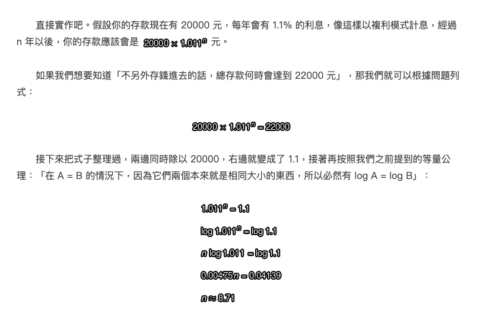

# python 程式結構
## 基礎IPython 
執行IPython Shell  

```python
$ ipython
Python 3.7.6 (default, Jan  8 2020, 20:23:39) [MSC v.1916 64 bit (AMD64)]
Type 'copyright', 'credits' or 'license' for more information
IPython 7.12.0 -- An enhanced Interactive Python. Type '?' for help.

#安裝Numpy
$ pip install numpy
Installing collected packages: numpy
Successfully installed numpy-1.18.1
```

- 測試執行

```python
In [1]: import numpy as np

In [2]: data = {i:np.random.randn() for i in range(7)}

In [3]: data #和python不一樣的地方在於不需使用print(),可以直接輸出
Out[3]: 
{0: 1.0818001033112679,
 1: 0.49458607582804615,
 2: 1.8100857118408913,
 3: 0.2622883403607118,
 4: 1.1194071376407313,
 5: -0.32337336747509127,
 6: -0.3376644252472849}

In [4]: 

```

- 利用Tab 完成整行敘述

```python
#提示
In [1]: an_apple = 27 
In [2]: an_example = 42
In [3]: an<Tab>
an_apple and an_example any


#提示
In [3]: b = [1, 2, 3]
In [4]: b.<Tab>
b.append b.count b.insert b.reverse b.clear b.extend b.pop b.sort b.copy b.index b.removeb

#提示
In [1]: import datetime
In [2]: datetime.<Tab>
datetime.date datetime.MAXYEAR datetime.datetime datetime.MINYEAR datetime.datetime_CAPI datetime.time
datetime.timedelta datetime.timezone datetime.tzinfo
```

- %run指令(IPython)
- %load指令(Jupyter)

```python
#ipython_script_test.py
a = 5
b = 6
c = 7.5

#IPython使用%run
In [16]: %run ipython_script_test.py

In [17]: a
Out[17]: 5

In [18]: b
Out[18]: 6

In [19]: c
Out[19]: 7.5

#使用jupyter notebook
In [16]: %run ipython_script_test.py

```

## 使用?檢查
```python
In[8]:b=[1,2,3]
In [9]: b?

Type: list
String Form:[1, 2, 3]
Length: 3
Docstring:
list() -> new empty list
list(iterable) -> new list initialized from iterable's items

In [10]: print?

Docstring:
print(value, ..., sep=' ', end='\n', file=sys.stdout, flush=False)
Prints the values to a stream, or to sys.stdout by default.
Optional keyword arguments:
file: a file-like object (stream); defaults to the current sys.stdout. sep: stringinsertedbetweenvalues,defaultaspace.
end: stringappendedafterthelastvalue,defaultanewline.
flush: whether to forcibly flush the stream.
Type: builtin_function_or_method
```

## 註解
```python
>>> # 60 sec/min * 60 min/hr * 24 hr/day 
>>> seconds_per_day = 86400

>>> seconds_per_day = 86400 # 60 sec/min * 60 min/hr * 24 hr/day


#python不支援多行註解
>>> # I can say anything here, even if Python doesn't like it,
... # because I'm protected by the awesome
... # octothorpe. ...
>>>

>>> print("No comment: quotes make the # harmless.")
 No comment: quotes make the # harmless.

```


## python數學運算子

運算子 | 描述  | 範例
-----| ------- | ----
| + | 加法 | 5+8
| - | 減法 | 90-10  
| * | 乘法 | 4*7
| / | 浮點數除法 | 7 / 2
| // | 整數除法 | 7 // 2
| % | 餘數  | 7 % 3
| ** | 次方 |  3 ** 4 

--- 
## python的整數

```python
>>> 5
5

>>> 0
0

#數字前不可以加0
>>> 05
      File "<stdin>", line 1
05
^
SyntaxError: invalid token #python的語法錯誤


#正整數
>>> 123
    123
>>> +123
    123
    
#負整數
>>> -123 
-123

#整數運算
>>>5+9 
   14 
>>>100-7 
   93 
>>>4-10 
   -6
   
#多個數值運算
>>>5+9+3
17 
>>>4+3-2-1+6 
	 10
	 
#乘法運算
>>>6*7
42
>>>7*6
42 
>>>6*7*2*3 
   252
   
#浮點數除法
>>>9/5 
   1.8

#整數除法
>>>9//5 
   1
#除數不可以為零
>>>5/0
Traceback (most recent call last):
File "<stdin>", line 1, in <module> ZeroDivisionError: division by zero >>>7//0
Traceback (most recent call last):
File "<stdin>", line 1, in <module> ZeroDivisionError: integer division or modulo by z


#變數可以運算
>>>a=95 
>>> a
95 
>>>a-3 
   92

#將變數自已的內容減3   
>>>a=a-3 
>>> a
92

>>>a=95 
>>>temp=a-3 
>>>a=temp

#上面敘述式，可以使用下面這行替代
>>>a=a-3

#餘數
>>>9%5 
   4
   
>>> divmod(9,5)
    (1, 4)

>>> 9//5 
   1 
>>> 9%5 
   4


```

## 數學運算子優先順序

```python
優先順序由上而下
()
**
正負
* / % //
+ -
=

>>>2+3*4 
   14
   
>>>(2+3)*4
   20

>>> 2 * (1 + 2) ** 2 - 2 ** 2 * 2 
	10
```

## 2,8,16進位
表示 | 進位
--- | ---
0b 0B | 2進位
0o 0O | 8進位
0x 0X | 16進位

```python
#10進位
>>> 10 
10

#2進位
>>> 0b10
2

#8進位
>>> 0o10
8

#16進位
>>> 0x10
16

```

## 類型轉換

```python
>>> int(True)
    1
>>> int(False)
    0
 
 
    
>>> int(98.6) 
    98
>>> int(1.0e4) 
    10000
 
  
    
>>> int('99') 
    99
>>> int('-23') 
    -23
>>> int('+12')
    12


>>> int(12345)
    12345


>>> int('99 bottles of beer on the wall')
Traceback (most recent call last):
File "<stdin>", line 1, in <module>
ValueError: invalid literal for int() with base 10: '99 bottles of beer on the wall' >>> int('')
Traceback (most recent call last):
File "<stdin>", line 1, in <module>
ValueError: invalid literal for int() with base 10: ''


>>> int('98.6')
Traceback (most recent call last):
File "<stdin>", line 1, in <module>
ValueError: invalid literal for int() with base 10: '98.6' >>> int('1.0e4')
Traceback (most recent call last):
File "<stdin>", line 1, in <module>
ValueError: invalid literal for int() with base 10: '1.0e4'


>>>4+7.0 
   11.0
   

>>>True+2
    3
>>> False + 5.0 
    5.0
```

## int的範圍

```python
>>>
>>> googol = 10**100
>>> googol
   100000000000000000000000000000000000000000000000000000000000000000000000000000
00000000000000000000000

>>> googol * googol
    100000000000000000000000000000000000000000000000000000000000000000000000000000000000000000000000000000000000000000000000000000000000000000000000000000000000000000000000000000000000000000000000000000000


    
```

## float浮點數

```python
>>> float(True) 
    1.0
>>> float(False)
    0.0

>>> float(98) 
    98.0
>>> float('99') 
    99.0

    

>>> float('98.6')
    98.6
>>> float('-1.5')
    -1.5
>>> float('1.0e4')
    10000.0


```

## 字串

```python
>>> 'Snap'
    'Snap'
    
>>> "Crackle"
    'Crackle'

>>> "'Nay,' said the naysayer."
"'Nay,' said the naysayer."

>>> 'The rare double quote in captivity: ".'
'The rare double quote in captivity: ".'

>>> 'A "two by four" is actually 1 1⁄2" × 3 1⁄2".'
'A "two by four is" actually 1 1⁄2" × 3 1⁄2".'

>>> "'There's the man that shot my paw!' cried the limping hound." "'There's the man that shot my paw!' cried the limping hound."
 
```

### 多行文字

```python

>>> '''Boom!'''
    'Boom'
    
>>> """Eek!"""
    'Eek!'

#單行文字    
>>> poem = "Apple Arcade 推出的最新遊戲《Next Stop Nowhere》，由位於洛杉磯的開發商 Night School Studio 出品。這款遊戲是太空公路之旅的夥伴冒險，其中不同角色間展開了一些精彩的劇情。在銀河系的外圍，每個人和所有事物之間都有充分的空間，Night School 希望這款遊戲可為近來可能感到孤立的玩家提供一些慰藉。"

#單行文字
>>>"Apple Arcade 推出的最新遊戲《Next Stop Nowhere》，\
由位於洛杉磯的開發商 Night School Studio 出品。\
這款遊戲是太空公路之旅的夥伴冒險，其中不同角色間展開了一些精彩的劇情。\
在銀河系的外圍，每個人和所有事物之間都有充分的空間，Night School\
希望這款遊戲可為近來可能感到孤立的玩家提供一些慰藉。"


>>> poem2 = '''Apple Arcade 推出的最新遊戲《Next Stop Nowhere》，由位於洛杉磯的開發商 Night School Studio 出品。

這款遊戲是太空公路之旅的夥伴冒險，其中不同角色間展開了一些精彩的劇情。

在銀河系的外圍，每個人和所有事物之間都有充分的空間，Night School 希望這款遊戲可為近來可能感到孤立的玩家提供一些慰藉。 '''

>>> print(poem2)
Apple Arcade 推出的最新遊戲《Next Stop Nowhere》，由位於洛杉磯的開發商 Night School Studio 出品。

這款遊戲是太空公路之旅的夥伴冒險，其中不同角色間展開了一些精彩的劇情。

在銀河系的外圍，每個人和所有事物之間都有充分的空間，Night School 希望這款遊戲可為近來可能感到孤立的玩家提供一些慰藉。


>>> print(99, 'bottles', 'would be enough.') 
    99 bottles would be enough.
    
    

>>> ''
    ''
>>> ""
    ''
>>> ''''''
    ''
>>> """"""
    ''
>>>


#使用str()轉換為字串型別
>>> str(98.6) 
    '98.6'
>>> str(1.0e4) 
    '10000.0'
>>> str(True)
    'True'
  
```
   
## Continue Lines with \

```python
>>> alphabet = ''
>>> alphabet += 'abcdefg'
>>> alphabet += 'hijklmnop'
>>> alphabet += 'qrstuv'
>>> alphabet += 'wxyz'

#連結字串
>>> alphabet = 'abcdefg' + \
... 'hijklmnop' + \
... 'qrstuv' + \
... 'wxyz'


>>> 1+2+
File "<stdin>", line 1
1+2+ ^
SyntaxError: invalid syntax 
>>>1+2+\
... 3
6


#字串使用加法運算
#字串無法自動加數值
>>> bottles = 99
>>> base = ""
>>> base = base + 'current inventory:'
>>> base = base + str(bottles)
'current inventory:99'

#脫溢字元(特殊字元)
- 反斜線作為跳脫字元，可用於引用特殊字元。
	- \\ 反斜線
	- \’ 單引號
	- \” 雙引號
	- \n 換行
	- \t 固定間隔


>>> games = '遊戲：《鬼靈精大腳怪》\n說明：今天的遊戲更新為玩家開啟了一個全新的探索環境。從城鎮下方的新碼頭出發，乘渡輪前往新的小島，然後乘坐四輪驅動車四處巡遊，或者在衝浪遊戲中盡情衝浪。玩家還可以購買新船進行升級與比賽，或是出海捕捉鹹水魚。這是調皮大腳怪的暑假！\n\n遊戲：《迷你公路》\n說明：《迷你公路》推出了一項新更新，以透過 Fast Forward 模式協助加快道路網絡的建立，使玩家能選擇其遊戲速度。' 

>>> print(games)
遊戲：《鬼靈精大腳怪》
說明：今天的遊戲更新為玩家開啟了一個全新的探索環境。從城鎮下方的新碼頭出發，乘渡輪前往新的小島，然後乘坐四輪驅動車四處巡遊，或者在衝浪遊戲中盡情衝浪。玩家還可以購買新船進行升級與比賽，或是出海捕捉鹹水魚。這是調皮大腳怪的暑假！

遊戲：《迷你公路》
說明：《迷你公路》推出了一項新更新，以透過 Fast Forward 模式協助加快道路網絡的建立，使玩家能選擇其遊戲速度。


>>> print('\tabc') 
    abc
>>> print('a\tbc') 
    a bc
>>> print('ab\tc') 
    ab c
>>> print('abc\t') 
    abc


>>> testimony = "\"I did nothing!\" he said. \"Not that either! Or the other thing.\""

>>> print(testimony)
"I did nothing!" he said. "Not that either! Or the other thing."

>>> fact = "The world's largest rubber duck was 54'2\" by 65'7\" by 105'"
 
>>> print(fact)
The world's largest rubber duck was 54'2" by 65'7" by 105'

>>> speech = 'Today we honor our friend, the backslash: \\.' 
>>> print(speech)
Today we honor our friend, the backslash: \.


# 使用 + 運算子
>>> 'Release the kraken! ' + 'At once!'
    'Release the kraken! At once!'

>>> a = 'Duck.' 
    b=a
    
>>> c = 'Grey Duck!' 

>>>a+b+c 
   'Duck.Duck.Grey Duck!'


>>> print(a, b, c) 
    Duck. Duck. Grey Duck!
    
```

## 資料輸入
- input 代表資料輸入
- 輸入資料後可利用變數 .__class__ 方式查詢變數的資料型態。
- 預設輸入的資料型態為字串
	- 若是整數資料您必須加入 int( ) 轉換。
		- 如果輸入浮點數或者字串都會產生錯誤訊息。
	- 若是浮點數小數資料您必須加入 float( ) 轉換。
		- 如果輸入整數會當作浮點數處理，輸入字串會產生錯誤訊息。  

```python
資料輸出入:請動手操作，並留意輸出結果
# input01.py

a = input("輸入整數1a: ") 
b = input("輸入整數1b: ") 
c = int(input("int輸入c:")) 
d = int(input("int輸入d:")) 
f=a+b
g=c+d 
print(f)
print(g)
```

```python
資料輸出入:請動手操作，並留意輸出結果
# input02.py

c = int(input("int輸入c:"))
d = int(input("int輸入d:")) 
g=c+d
print(g)
h = float(input("float輸入h:"))
i = float(input("float輸入i:"))
j=h+d
print(j)
```

```python
資料輸出入:請動手操作，並留意輸出結果
# input03.py

a = input("輸入字串: ")
print(a,a.__class__ )
a = input("輸入整數: ")
print(a,a.__class__ )
a = float(input("float輸入浮點數: "))
print(a,a.__class__ )
a = int(input("int輸入整數:"))
print(a,a.__class__ )
a = int(input("int輸入字串:"))
print(a,a.__class__ )
```

## 輸出資料格式化

在 Python 中，如果我們想要將數值、文字等多種不同的資料結合並輸出，除了使用 `str()` 將數值轉換為字串後再進行拼接之外，更優雅且強大的做法是使用**格式化輸出**。

Python 最傳統且廣泛使用的格式化方式是 **`%` 運算子（% Formatting）**。我們可以透過特定的**格式代碼（Format Specifier）**來控制資料輸出的類型與位數（例如限制小數點位數、靠左/靠右對齊等）。

---

### 1. 常用的資料格式代碼

格式化輸出的基本語法為：
`print("輸出字串與格式代碼" % (變數1, 變數2, ...))`

#### 📝 整數資料的格式代碼
可以用於輸出十進位、八進位或十六進位的整數：

| 格式代碼 | 輸出方式 |
| :--- | :--- |
| `%d` 或 `%i` | 以十進位方式輸出整數 |
| `%o` | 以八進位方式輸出整數 |
| `%x` 或 `%X` | 以十六進位方式輸出整數（`%x` 輸出小寫，`%X` 輸出大寫） |

* 範例：`print("十進位: %d, 十六進位: %X" % (123, 123))`（輸出: `十進位: 123, 十六進位: 7B`）

#### 📝 浮點數資料的格式代碼
用於控制小數或科學記數法的輸出：

| 格式代碼 | 說明 |
| :--- | :--- |
| `%f` 或 `%F` | 以一般浮點數格式輸出（預設顯示小數點後 6 位） |
| `%e` 或 `%E` | 以科學記數法格式輸出 |
| `%g` 或 `%G` | 自動判斷使用 `%f` 或 `%e`（選擇較簡短的顯示方式） |

#### 📝 文字與字元的格式代碼

| 格式代碼 | 說明 |
| :--- | :--- |
| `%s` | 以字串方式輸出 |
| `%c` | 以單一字元方式輸出（可接收字元或 ASCII 碼） |

---

### 2. 控制輸出位數與對齊方式（整數、字元與字串）

我們可以在 `%` 符號與格式代碼（如 `d`、`s`）之間加入一個整數 `width`，用來代表**最小輸出寬度**：
- **若資料實際寬度小於指定寬度**：
  - `width` 為正數時：**向右對齊**，左邊補空格。
  - `width` 為負數時：**向左對齊**，右邊補空格。
- **若資料實際寬度大於指定寬度**：照常輸出完整資料，不會被截斷。

#### 操作範例：字串格式化對齊
```python
# format2.py

c = '我' 
print("1*%c*" % (c))      # 輸出: 1*我* (原樣輸出)
print("2*%5s*" % (c))     # 輸出: 2*    我* (寬度 5，向右對齊)
print("3*%-5s*" % (c))    # 輸出: 3*我    * (寬度 5，向左對齊)
print("4*%2s*" % (c))     # 輸出: 4* 我* (寬度 2，向右對齊)
```

---

### 3. 控制浮點數的寬度與小數位數

對於浮點數，我們可以用 `%n.mf` 來精確控制輸出格式：
- `n`：**總輸出寬度**（包含整數、小數點及小數部分）。
  - 若實際總寬度小於 `n`，會依正負值進行靠右或靠左對齊。
  - 若實際總寬度大於 `n`，則不受限制照常輸出。
- `m`：**小數點後的位數**。
  - 若實際小數位數多於 `m`，會將第 `m+1` 位數**四捨五入**。
  - 若實際小數位數少於 `m`，會在右邊**補 0**。

#### 操作範例：浮點數格式化
```python
# format3.py

b = 123.926 
print("5*%d*" % (b))        # 輸出: 5*123* (轉為整數，直接無條件捨去小數)
print("6*%7.2f*" % (b))     # 輸出: 6* 123.93* (總寬度 7，保留 2 位小數，四捨五入，右對齊)
print("7*%-9.4f*" % (b))    # 輸出: 7*123.9260 * (總寬度 9，保留 4 位小數，補0，左對齊)
print("8*%.2f*" % (b))      # 輸出: 8*123.93* (不限總寬度，僅限制保留 2 位小數)
```

---

### 4. 浮點數的精度問題與 Decimal 模組

在計算機科學中，由於浮點數在硬體底層是以**二進位**方式儲存的，無法精確地表示所有的十進位小數。這會導致看似簡單的數學運算產生微小的誤差。

#### ⚠️ 經典的浮點數誤差範例：
- `1.1 + 2.2` 得到的結果是 `3.3000000000000003`，而不是 `3.3`。
- `0.1 + 0.1 + 0.1 - 0.3` 得到的結果是 `5.551115123125783e-17`，而不是 `0.0`。

格式化輸出（如 `%.2f`）只能幫我們在**顯示時**做四捨五入，但無法解決**底層數值運算不精確**的問題。

#### 💡 解決方案：引用 `decimal` 模組
如果專案需要進行極高精度的數值計算（如金融與貨幣計算），建議使用 Python 內建的 `decimal` 模組，改用十進位精確模式操作。

#### 操作範例：精確的十進位運算
```python
# floata1.py

from decimal import Decimal

# 1. 傳統浮點數運算 vs. Decimal 運算
print("傳統 1.1 + 2.2 =", 1.1 + 2.2)
print("Decimal 運算 =", Decimal('1.1') + Decimal('2.2'))
print("-" * 30)

# 2. 累加與減法誤差對比
print("傳統 0.1 累減 =", 0.1 + 0.1 + 0.1 - 0.3)
print("Decimal 運算 =", Decimal('0.1') + Decimal('0.1') + Decimal('0.1') - Decimal('0.3'))
print("-" * 30)

# 3. 尾隨零的精確保留
print("傳統 1.20 + 1.30 =", 1.20 + 1.30)
print("Decimal 運算 =", Decimal('1.20') + Decimal('1.30'))
```
> **⚠️ 重要提示**：使用 `Decimal` 時，傳入的數值**必須**以**字串格式**（如 `Decimal('1.1')`）包裹。如果直接傳入浮點數（如 `Decimal(1.1)`），依然會把浮點數本身的二進位誤差帶入，失去精確計算的效果。

---
### 數值計算:請動手操作，並留意輸出結果
```python
#num.py

a,b,c=4,2,5
d,f=3.25,5.5
print (a*b) 
print (a**b) 
print (a % 3) 
print (d + f) 
print (c//b) 
print (a/b)
```

### Homework(mathop.py):
- 讓使用者輸入被除數(整數)及除數(整數，不可以是零)
- 程式會顯示兩數相除的商及餘數。

```python
請輸入被除數(整數):45
請輸入除數(整數,不可以為0):4
商 11 餘數: 1
```
[解題](mathop.py)

### Homework(plus_s.py):
- 計算使用者輸入的2個任意數，程式會顯示2數相加的總和。  

```python
請輸入第一個數值:45.67
請輸入第二個數值:67.47
兩個數的和是xxx.xx
```
[解題](plus_s.py)

---

## 複合指定運算子
- 當「=」左右兩邊是相同資料時可以使用精簡方式:
	- 省略「=」右邊相同資料。
	- 將「=」右邊的計算符號移到「=」左邊。
- 例如以下操作方式可作變更
	- x=x+2，可精簡為 x+=2
	- y=y-3，可精簡為 y-=3

### 精簡計算式:請動手操作，並留意輸出結果
```python
#money.py
money = 50000 
cell = int(input("請輸入手機金額:"))
money -= cell
print("剩餘款為:" + str(money)) 
```

### Homework(complex.py):
- 請使用者輸入一個任意數，程式會顯示此數的平方值及立方值  

```python
請輸入任意數:3
此數的平方是:9.0
此數的立方是:27.0
```
[解題](complex.py)

### Homework(complex_s.py):
- 請以(複合指定運算子)設計程式,讓用者輸入三個任意數，程式會顯示3數相加的總和(float)

```python
請輸入第一個數:87.9
請輸入第二個數:45
請輸入等三個數:87.5
三個數的總和為:220.4
```
[解題](complex_s.py)

### Homework(ladder.py):
- 讓使用者輸入梯形的上底、下底及高，程式會計算梯形的面積(上底加下底乘以高除以2)

```python
請輸入梯形的上底(公分):5
請輸入梯形的下底(公分):10
請輸入梯形的高(公分):2
梯形的面積:15平方公分
```
[解題](ladder.py) 

[講師專用](ladder.md)


### Homework(circle_s.py)
- 使用者輸入圓柱體的半徑及高，程式會計算圓柱體的體積
- 圓柱體體積的公式為「圓週率乘以半徑平方再乘以高」。

```
請輸入圓柱體的半徑(公分):10
請輸入圓柱體的高(公分):5
圓柱體的體積:xxxx立方公分
```
[解題](circle_s.py)

### 高中數學
### Homework(degree.py)
- 讓使用者輸入直角三角形的對邊
- 讓使用者輸入直角三角形的斜邊
- 計算角度
- 公式:
	- sin(x) = 對邊 / 斜邊
	- x是radian(弧度)

```
請輸入對邊:2.5
請輸入斜邊:5
直角三角形的角度為:30degree

```

```python
round(math.degrees(math.asin(2.5/5)))
```

[講師專用](degree.md)

### 高中數學
### Homework(log運算)



[講師專案](./log.md)
```
import statistics
statistics.log(22000/20000) / statistics.log(1.011)
```


