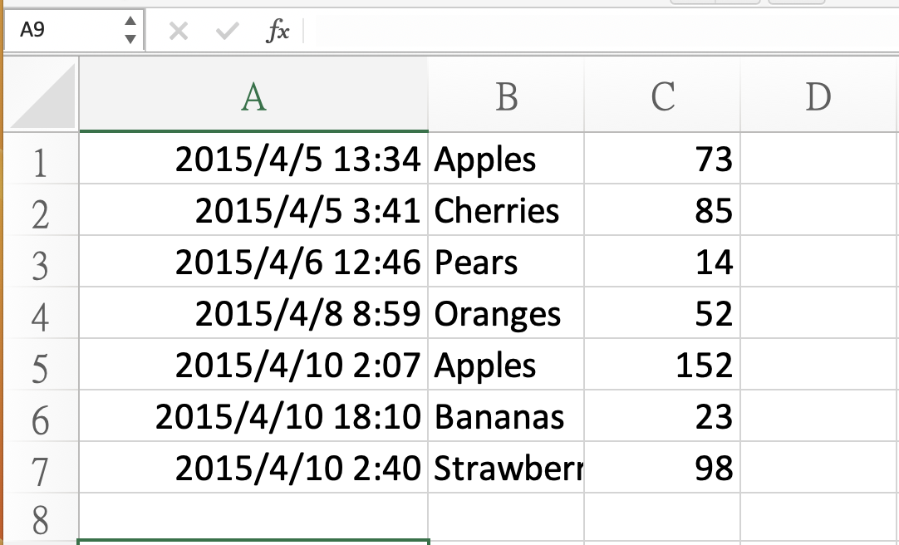
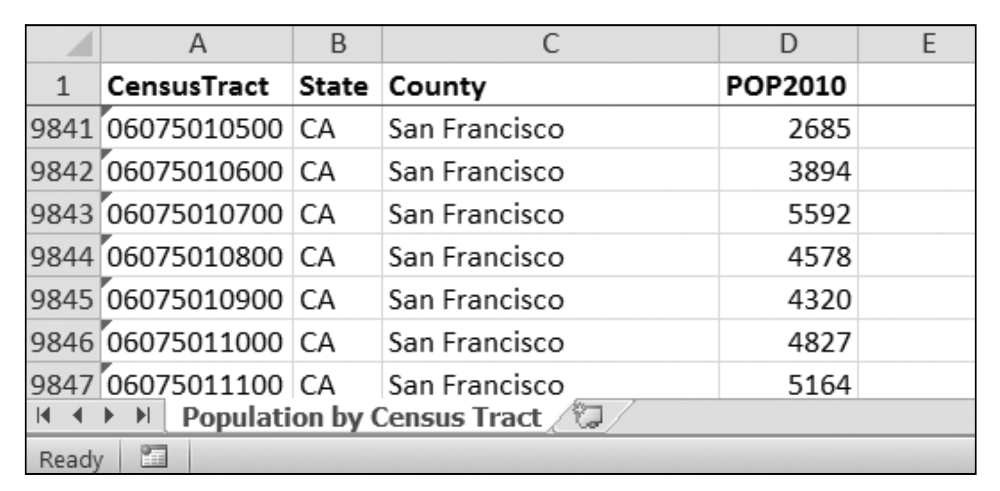

# 處理Excel檔

## excel檔內的專有名稱
- 一個excel檔稱為workbook
- 每個workbook有很多的sheets(worksheet)
- workbook正在處理的sheet稱為active sheet
- sheet的欄(columns)由A開始
- sheet的列(rows)由1開始
- sheet是由欄和列組成
- 儲存格(cell)由特定的欄和列組成

## 使用openpyxl

```python
$ pip install -U openpyxl
```

## 使用openpyxl開啟excel檔

- openpyxl.load_workbook()



```python
import openpyxl
wb = openpyxl.load_workbook('example.xlsx')
print(type(wb))

結果:================
<class 'openpyxl.workbook.workbook.Workbook'>
```

## 取得sheets和sheets的資訊

- workbook.sheetnames
- workbook['sheetnames']

```python
import openpyxl
wb = openpyxl.load_workbook('example.xlsx')
#取得目前sheetnames的資訊
print(wb.sheetnames)
#結果:=====================
#['Sheet1', 'Sheet2', 'Sheet3']
#=========================

#取得sheet
sheet = wb['Sheet3']
print(sheet)
#結果:=====================
#<Worksheet "Sheet3">
#=========================

print(type(sheet))
#結果:=====================
#<class 'openpyxl.worksheet.worksheet.Worksheet'>
#=========================

print(sheet.title)
#結果:=====================
#Sheet3
#=========================


#打開excel檔,第一個顯示的sheet(active)
anotherSheet = wb.active
print(anotherSheet)
#結果:=====================
#<Worksheet "Sheet1">
#=========================
```

##  從sheet取得cell

```python
import openpyxl

wb = openpyxl.load_workbook('example.xlsx')
sheet = wb['Sheet1']
print(sheet['A1'])
#結果:=====================
#<Cell 'Sheet1'.A1>
#=========================

print(sheet['A1'].value)

#結果:=====================
#2015-04-05 13:34:02
#=========================

c = sheet['B1']
print(c.value)

#結果:=====================
#Apples
#=========================

#取得row,column,value
print(f"Row {c.row},Column {c.column}, value {c.value}")
#結果:=====================
#Row 1,Column 2, value Apples
#=========================

#取得coordinate,value
print(f"Cell {c.coordinate},Value{c.value}")
#結果:=====================
#Cell B1,ValueApples
#=========================

print(sheet['C1'].value)
#結果:=====================
#73
#=========================
```

### 取得Cell,透過sheet.cell(row=數字,column=數字)

- 數字由1開始,而不是0

```python
print(sheet.cell(row=1, column=2))
#結果:=====================
#<Cell 'Sheet1'.B1>
#=========================

print(sheet.cell(row=1, column=2).value)
#結果:=====================
#Apples
#=========================

for i in range(1, 8, 2):
    print(i, sheet.cell(row=i, column=2).value)
#結果:=====================
#1 Apples
#3 Pears
#5 Apples
#7 Strawberries
#=========================    

```

### 使用sheet.max_row和sheet.max_column
- 取得此sheet,最大row
- 取得此sheet,最大column

```python
import openpyxl

wb = openpyxl.load_workbook('example.xlsx')
sheet = wb['Sheet1']
max_row = sheet.max_row
max_column = sheet.max_column
print((max_row, max_column))
#結果:=====================
#(7, 3)
#=========================

for row in range(1,max_row+1):
    for column in range(1,max_column+1):
        print(f"{sheet.cell(row=row,column=column).value}",end=" ")
    print()
#結果:=====================
2015-04-05 13:34:02 Apples 73 
2015-04-05 03:41:23 Cherries 85 
2015-04-06 12:46:51 Pears 14 
2015-04-08 08:59:43 Oranges 52 
2015-04-10 02:07:00 Apples 152 
2015-04-10 18:10:37 Bananas 23 
2015-04-10 02:40:46 Strawberries 98 
#=========================
```

### 欄位A,B,C文字和數字1,2,3的相互轉換

- openpyxl.utiles.column_index_from_string()
- openpyxl.utiles.get_column_letter()

```python
import openpyxl
from openpyxl.utils import get_column_letter, column_index_from_string

print(get_column_letter(1))

print(get_column_letter(2))

print(get_column_letter(27))

print(get_column_letter(900))

#結果:=====================
A
B
AA
AHP
#=========================

wb = openpyxl.load_workbook('example.xlsx')
sheet = wb['Sheet1']
print(get_column_letter(sheet.max_column))

print(column_index_from_string('A'))

print(column_index_from_string('AA'))

#結果:=====================
C
1
27
#=========================
```

### 一次取得局部矩形範圍的cell
- sheet['A1':'C3']

```python
import openpyxl

wb = openpyxl.load_workbook('example.xlsx')
sheet = wb['Sheet1']
print(sheet['A1':'C3'])
#結果:=====================
((<Cell 'Sheet1'.A1>, <Cell 'Sheet1'.B1>, <Cell 'Sheet1'.C1>), (<Cell 'Sheet1'.A2>, <Cell 'Sheet1'.B2>, <Cell 'Sheet1'.C2>), (<Cell 'Sheet1'.A3>, <Cell 'Sheet1'.B3>, <Cell 'Sheet1'.C3>))
#=========================

for rowOfCellObjects in sheet['A1':'C3']:
    for cellObj in rowOfCellObjects:
        print(cellObj.coordinate, cellObj.value)
    print("=====================")
    
#結果:=====================
A1 2015-04-05 13:34:02
B1 Apples
C1 73
=====================
A2 2015-04-05 03:41:23
B2 Cherries
C2 85
=====================
A3 2015-04-06 12:46:51
B3 Pears
C3 14
=====================
#=========================

```

### 一次取得整欄的cell

```python
wb = openpyxl.load_workbook('example.xlsx')
sheet = wb.active
print(list(sheet.columns)[1]) #取得第2欄(B)

#結果:=====================
(<Cell 'Sheet1'.B1>, <Cell 'Sheet1'.B2>, <Cell 'Sheet1'.B3>, <Cell 'Sheet1'.B4>, <Cell 'Sheet1'.B5>, <Cell 'Sheet1'.B6>, <Cell 'Sheet1'.B7>)
#=========================

for cellObj in list(sheet.columns)[1]:
    print(cellObj.value)
    
#結果:=====================
Apples
Cherries
Pears
Oranges
Apples
Bananas
Strawberries
#=========================
```

###  讀取資料練習

- censuspopdata.xlsx



```python
import openpyxl, pprint
wb = openpyxl.load_workbook('censuspopdata.xlsx')
sheet = wb['Population by Census Tract']

countyData = {}

for row in range(2, sheet.max_row +1):
    state = sheet['B' + str(row)].value
    county = sheet['C' + str(row)].value
    pop = sheet['D' + str(row)].value

#目標=====================
#{'AK': 
# {'Aleutians East': {'pop': 3141, 'tracts': 1}, 
# 'Aleutians West': {'pop': 5561, 'tracts': #2}, 
# 'Anchorage': {'pop': 291826, 'tracts': 55}, 
# 'Bethel': {'pop': 17013, 'tracts': 3},
# 'Bristol Bay': {'pop': 997, 'tracts': 1},
# countyData['AK']['Anchorage']['pop']
#=======================
		#檢查有沒有state,沒有就建立空的{}
    countyData.setdefault(state,{})
    
    #檢查有沒有county,沒有就建立空的{'tracts':0, 'pop':0}
    countyData[state].setdefault(county,{'tracts':0, 'pop':0})
    countyData[state][county]['tracts'] += 1
    countyData[state][county]['pop'] += int(pop)

#pprint.pformat() 格式化dictionary的資料,使列印比較整齊
print(pprint.pformat(countyData))

#結果:=====================
{'AK': {'Aleutians East': {'pop': 3141, 'tracts': 1},
        'Aleutians West': {'pop': 5561, 'tracts': 2},
        'Anchorage': {'pop': 291826, 'tracts': 55},
        'Bethel': {'pop': 17013, 'tracts': 3},
        'Bristol Bay': {'pop': 997, 'tracts': 1},
        'Denali': {'pop': 1826, 'tracts': 1},
        'Dillingham': {'pop': 4847, 'tracts': 2},
        'Fairbanks North Star': {'pop': 97581, 'tracts': 19},
        'Haines': {'pop': 2508, 'tracts': 1},
        'Hoonah-Angoon': {'pop': 2150, 'tracts': 2},
        'Juneau': {'pop': 31275, 'tracts': 6},
        'Kenai Peninsula': {'pop': 55400, 'tracts': 13},
        'Ketchikan Gateway': {'pop': 13477, 'tracts': 4},
        'Kodiak Island': {'pop': 13592, 'tracts': 5},
        'Lake and Peninsula': {'pop': 1631, 'tracts': 1},
        'Matanuska-Susitna': {'pop': 88995, 'tracts': 24},
        'Nome': {'pop': 9492, 'tracts': 2},
        'North Slope': {'pop': 9430, 'tracts': 3},
        'Northwest Arctic': {'pop': 7523, 'tracts': 2},
        'Petersburg': {'pop': 3815, 'tracts': 1},
        'Prince of Wales-Hyder': {'pop': 5559, 'tracts': 4},
        'Sitka': {'pop': 8881, 'tracts': 2},
        'Skagway': {'pop': 968, 'tracts': 1},
        'Southeast Fairbanks': {'pop': 7029, 'tracts': 2},
        'Valdez-Cordova': {'pop': 9636, 'tracts': 3},
...
        'Teton': {'pop': 21294, 'tracts': 4},
        'Uinta': {'pop': 21118, 'tracts': 3},
        'Washakie': {'pop': 8533, 'tracts': 3},
        'Weston': {'pop': 7208, 'tracts': 2}}}
#=========================
```

## 使用openpyxl建立excel檔

- 建立workbook
- 建立sheet

```python
import openpyxl

wb = openpyxl.Workbook()
print(wb.sheetnames)

#結果:=====================
['Sheet']
#=========================

sheet = wb.active
print(sheet.title)

#結果:=====================
Sheet
#=========================

sheet.title = "練習1"
wb.sheetnames

#結果:=====================
['練習1']
#=========================


```

- 儲存workbook成為excel檔案

```python
import openpyxl
wb = openpyxl.load_workbook('example.xlsx')
sheet = wb.active
sheet.title =  "活頁1"
wb.save('example_copy.xlsx')
```

### 建立和刪除sheet

```python

```


